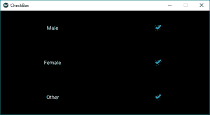
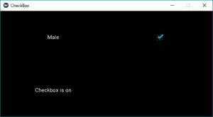

# Python | Kivy 中的 Checkbox 小部件

> 原文:[https://www . geesforgeks . org/python-checkbox-widget-in-kivy/](https://www.geeksforgeeks.org/python-checkbox-widget-in-kivy/)

Kivy 是 Python 中独立于平台的 GUI 工具。 [Kivy](https://www.geeksforgeeks.org/kivy-tutorial/) 应用可以在安卓、IOS、linux、Windows 等上运行。它基本上是用来开发安卓应用的，但并不意味着它不能在桌面应用上使用。

> [Kivy 教程–通过示例学习 Kivy](https://www.geeksforgeeks.org/kivy-tutorial/)。

**复选框小部件–**
复选框是一个特定的双态按钮，可以选中也可以不选中。复选框有一个描述复选框用途的附带标签。复选框可以组合在一起形成单选按钮。复选框用于传达是否要应用设置。

要使用**复选框**，首先必须从包含滑块所有功能的模块中导入**复选框**，即

```py
 from kivy.uix.checkbox import CheckBox 
```

**创建滑块时要遵循的基本方法:**

```py
1) import kivy
2) import kivy App
3) import gridlayout
4) import Label
5) import Checkbox
6) import Widget
7) set minimum version(optional)
8) Extend the class
9) Add widget in the class
10) Create the App class
11) run the instance of the class
```

**现在 Kivy 中如何创建 Checkbox 的程序:**

## 蟒蛇 3

```py
# Program to learn how to make checkbox in kivy

# import kivy module
import kivy

# base Class of your App inherits from the App class. 
# app:always refers to the instance of your application 
from kivy.app import App

# The :class:`Widget` class is the base class
# required for creating Widgets.
from kivy.uix.widget import Widget

# The Label widget is for rendering text.
from kivy.uix.label import Label

# To use the checkbox must import it from this module
from kivy.uix.checkbox import CheckBox

# The GridLayout arranges children in a matrix.
from kivy.uix.gridlayout import GridLayout

# Container class for the app's widgets
class check_box(GridLayout):

    def __init__(self, **kwargs):
        # super function can be used to gain access
        # to inherited methods from a parent or sibling class
        # that has been overwritten in a class object.
        super(check_box, self).__init__(**kwargs)

        # 2 columns in grid layout
        self.cols = 2

        # Add checkbox, widget and labels
        self.add_widget(Label(text ='Male'))
        self.active = CheckBox(active = True)
        self.add_widget(self.active)

        self.add_widget(Label(text ='Female'))
        self.active = CheckBox(active = True)
        self.add_widget(self.active)

        self.add_widget(Label(text ='Other'))
        self.active = CheckBox(active = True)
        self.add_widget(self.active)

# App derived from App class
class CheckBoxApp(App):
    def build(self):     
        return check_box()

# Run the app
if __name__ == '__main__':
    CheckBoxApp().run()
```

**输出:**



**现在的问题是，我们如何将回调绑定或附加到 Checkbox？**
因此给出了一个简单的例子，用点击绑定复选框，即当点击时打印“复选框已选中”，否则打印“复选框未选中”。

**现在编程安排对复选框的回调，即复选框是否被选中。**

## 蟒蛇 3

```py
# Program to learn how to make checkbox
# and adding callback in kivy

# import kivy module
import kivy

# base Class of your App inherits from the App class. 
# app:always refers to the instance of your application 
from kivy.app import App

# The :class:`Widget` class is the base class
# required for creating Widgets.
from kivy.uix.widget import Widget

# The Label widget is for rendering text.
from kivy.uix.label import Label

# To use the checkbox must import it from this module
from kivy.uix.checkbox import CheckBox

# The GridLayout arranges children in a matrix.
# imports the GridLayout class for use in the app.
from kivy.uix.gridlayout import GridLayout

# Container class for the app's widgets
class check_box(GridLayout):

    def __init__(self, **kwargs):
        # super function can be used to gain access
        # to inherited methods from a parent or sibling class
        # that has been overwritten in a class object.
        super(check_box, self).__init__(**kwargs)

        # 2 columns in grid layout
        self.cols = 2

        # Add checkbox, Label and Widget
        self.add_widget(Label(text ='Male'))
        self.active = CheckBox(active = True)
        self.add_widget(self.active)

        # Adding label to screen
        self.lbl_active = Label(text ='Checkbox is on')
        self.add_widget(self.lbl_active)

        # Attach a callback
        self.active.bind(active = self.on_checkbox_Active)

    # Callback for the checkbox
    def on_checkbox_Active(self, checkboxInstance, isActive):
        if isActive:
            self.lbl_active.text ="Checkbox is ON"
            print("Checkbox Checked")
        else:
            self.lbl_active.text ="Checkbox is OFF"
            print("Checkbox unchecked")

# App derived from App class
class CheckBoxApp(App):
    def build(self):
        # build is a method of Kivy's App class used
        # to place widgets onto the GUI.
        return check_box()

# Run the app
if __name__ == '__main__':
    CheckBoxApp().run()
```

**输出:**



**视频输出:**

<video class="wp-video-shortcode" id="video-302520-1" width="640" height="360" preload="metadata" controls=""><source type="video/webm" src="https://media.geeksforgeeks.org/wp-content/uploads/20190510124219/checkbox.webm?_=1">[https://media.geeksforgeeks.org/wp-content/uploads/20190510124219/checkbox.webm](https://media.geeksforgeeks.org/wp-content/uploads/20190510124219/checkbox.webm)</video>

[参考:https://kivy . org/doc/stability/API-kivy . uix . checkbox . html](https://kivy.org/doc/stable/api-kivy.uix.checkbox.html)。