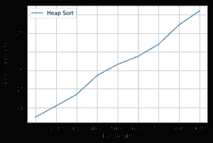

# 堆排序时间复杂度图的 Python 代码

> 原文:[https://www . geesforgeks . org/python-时间复杂度代码-堆排序图/](https://www.geeksforgeeks.org/python-code-for-time-complexity-plot-of-heap-sort/)

先决条件:[堆排序](https://www.geeksforgeeks.org/heap-sort/)
堆排序是基于 B [二进制堆](https://www.geeksforgeeks.org/check-if-a-given-binary-tree-is-heap/)数据结构的基于比较的排序技术。它类似于选择排序，我们首先找到最大元素，并将最大元素放在末尾。我们对剩余的元素重复同样的过程。
我们在这里实现了 Heap Sort，对不同大小的随机列表调用它，测量不同大小所花费的时间，并生成输入大小与所花费时间的关系图。

## 计算机编程语言

```py
# Python Code for Implementation and running time Algorithm
# Complexity plot of Heap Sort
# by Ashok Kajal
# This python code intends to implement Heap Sort Algorithm
# Plots its time Complexity on list of different sizes

# ---------------------Important Note -------------------
# numpy, time and matplotlib.pyplot are required to run this code
import time
from numpy.random import seed
from numpy.random import randint
import matplotlib.pyplot as plt

# find left child of node i
def left(i):
    return 2 * i + 1

# find right child of node i
def right(i):
    return 2 * i + 2

# calculate and return array size
def heapSize(A):
    return len(A)-1

# This function takes an array and Heapyfies
# the at node i
def MaxHeapify(A, i):
    # print("in heapy", i)
    l = left(i)
    r = right(i)

    # heapSize = len(A)
    # print("left", l, "Rightt", r, "Size", heapSize)
    if l<= heapSize(A) and A[l] > A[i] :
        largest = l
    else:
        largest = i
    if r<= heapSize(A) and A[r] > A[largest]:
        largest = r
    if largest != i:
       # print("Largest", largest)
        A[i], A[largest]= A[largest], A[i]
       # print("List", A)
        MaxHeapify(A, largest)

# this function makes a heapified array
def BuildMaxHeap(A):
    for i in range(int(heapSize(A)/2)-1, -1, -1):
        MaxHeapify(A, i)

# Sorting is done using heap of array
def HeapSort(A):
    BuildMaxHeap(A)
    B = list()
    heapSize1 = heapSize(A)
    for i in range(heapSize(A), 0, -1):
        A[0], A[i]= A[i], A[0]
        B.append(A[heapSize1])
        A = A[:-1]
        heapSize1 = heapSize1-1
        MaxHeapify(A, 0)

# randomly generates list of different
# sizes and call HeapSort function
elements = list()
times = list()
for i in range(1, 10):

    # generate some integers
    a = randint(0, 1000 * i, 1000 * i)
    # print(i)
    start = time.clock()
    HeapSort(a)
    end = time.clock()

    # print("Sorted list is ", a)
    print(len(a), "Elements Sorted by HeapSort in ", end-start)
    elements.append(len(a))
    times.append(end-start)

plt.xlabel('List Length')
plt.ylabel('Time Complexity')
plt.plot(elements, times, label ='Heap Sort')
plt.grid()
plt.legend()
plt.show()
# This code is contributed by Ashok Kajal
```

输出:

```py
Input : Unsorted Lists of Different sizes are Generated Randomly
Output :
1000 Elements Sorted by HeapSort in  0.023797415087301488
2000 Elements Sorted by HeapSort in  0.053856713614550245
3000 Elements Sorted by HeapSort in  0.08474737185133563
4000 Elements Sorted by HeapSort in  0.13578669978414837
5000 Elements Sorted by HeapSort in  0.1658182863213824
6000 Elements Sorted by HeapSort in  0.1875901601906662
7000 Elements Sorted by HeapSort in  0.21982946862249264
8000 Elements Sorted by HeapSort in  0.2724293921580738
9000 Elements Sorted by HeapSort in  0.30996323029421546

Complexity PLot for Heap Sort is Given  Below
```

