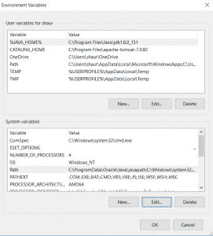

# Python 将 Html 转换为 PDF

> 原文:[https://www.geeksforgeeks.org/python-convert-html-pdf/](https://www.geeksforgeeks.org/python-convert-html-pdf/)

## 将 HTML/网页转换为 PDF

有很多网站不允许下载 pdf 形式的内容，他们要么要求购买他们的高级版本，要么没有 pdf 形式的下载服务。

### 从网页/HTML 到 PDF 的三步转换

**步骤 1:下载库 pdfkit**

```
 $ pip install pdfkit
```

**第二步:下载 Ubuntu/Debian 的 wkhtmltopdf**
:

```
 sudo apt-get install wkhtmltopdf
```

对于 Windows:
(a)下载链接:[WKHTMLTOPDF](https://github.com/wkhtmltopdf/wkhtmltopdf/releases/download/0.12.4/wkhtmltox-0.12.4_msvc2015-
win64.exe)
(b)Set:PATH 变量在环境变量中设置二进制文件夹。


**第三步:Python 代码下载:**
(一)已经保存的 HTML 页面

```
import pdfkit
pdfkit.from_file('test.html', 'out.pdf')
```

㈡按网站网址转换

```
import pdfkit
pdfkit.from_url('https://www.google.co.in/','shaurya.pdf')
```

(三)以 PDF 格式存储文本

```
import pdfkit
pdfkit.from_string('Shaurya GFG','GfG.pdf')
```

**恭喜**:您的 pdf 文件将被创建并保存在 python 文件所在的目录中。

杂项知识内容:
1。您可以传递包含多个网址或文件的列表:

```
pdfkit.from_url(['google.com', 'geeksforgeeks.org', 'facebook.com'], 'shaurya.pdf')
pdfkit.from_file(['file1.html', 'file2.html'], 'out.pdf')
```

2.将内容保存在变量中

```
# Use False instead of output path to save pdf to a variable
pdf = pdfkit.from_url('http://google.com', False)
```