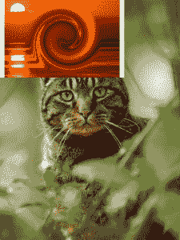
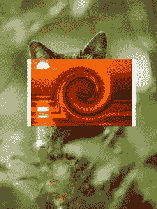

# Python |使用枕头将图像复制并粘贴到其他图像上

> 原文:[https://www . geeksforgeeks . org/python-复制并粘贴图像到其他图像-使用枕头/](https://www.geeksforgeeks.org/python-copy-and-paste-images-onto-other-image-using-pillow/)

在本文中，我们将学习如何使用枕头库将一个图像复制到另一个图像上。我们将使用`pillow`中的`image`模块和`copy()`和`paste()`方法来实现这个任务。

我们需要借助`copy()`方法创建两幅图像的副本，使其不影响原始图像，然后借助`paste()`方法将图像粘贴到另一幅图像上。

**输入图像–**

图片 1:


图片 2:


**例 1:**

```py
# import image module from pillow
from PIL import Image

# open the image
Image1 = Image.open('D:\cat.jpg')

# make a copy the image so that the 
# original image does not get affected
Image1copy = Image1.copy()
Image2 = Image.open('D:\core.jpg')
Image2copy = Image2.copy()

# paste image giving dimensions
Image1copy.paste(Image2copy, (0, 0))

# save the image 
Image1copy.save('D:\pasted2.png')
```

**输出:**


**示例 2:** 更改纸型，将图像 2 放在图像 1 中猫的脸上。

```py
# import image module from pillow
from PIL import Image

# open the image
Image1 = Image.open('D:\cat.jpg')

# make a copy the image so that 
# the original image does not get affected
Image1copy = Image1.copy()
Image2 = Image.open('D:\core.jpg')
Image2copy = Image2.copy()

# paste image giving dimensions
Image1copy.paste(Image2copy, (70, 150))

# save the image 
Image1copy.save('D:\pasted2.png')
```

**输出:**
