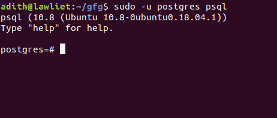
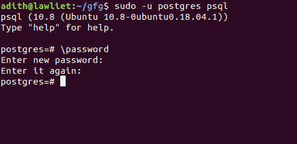
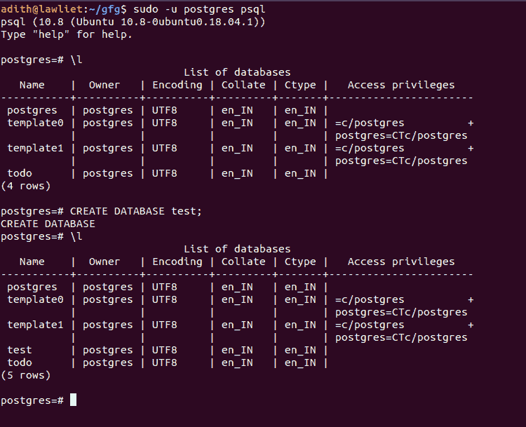

# Python | PostgreSQL 中的数据库管理

> 原文:[https://www . geesforgeks . org/python-database-management-in-PostgreSQL/](https://www.geeksforgeeks.org/python-database-management-in-postgresql/)

**PostgreSQL** 是一个开源的对象关系数据库管理系统。它以其可靠性、健壮性和性能而闻名。PostgreSQL 有各种 API(应用程序可编程接口)库，可用于各种流行的编程语言，如 Python。它为数据库管理提供了许多功能，如视图、触发器、索引(使用 B 树)等。

有几个 python 模块允许我们使用 PostgreSQL 连接和操作数据库:

*   Psycopg2
*   pg8000
*   py PostgreSQL
*   PyGreSQL

**Psycopg2** 是 PostgreSQL 最流行的 python 驱动程序之一。它被积极维护，并为不同版本的 python 提供支持。它还提供了对线程的支持，并且可以在多线程应用程序中使用。基于这些原因，它是开发者的热门选择。

在本文中，我们将通过用 python 构建一个简单的数据库管理系统来探索使用 psycopg2 的 PostgreSQl 的特性。

**安装:**

```py
sudo pip3 install psycopg2 
```

**注意:**如果使用的是 Python2，请使用 pip install 而不是 pip3

一旦 *psycopg* 已经安装在你的系统中，我们就可以连接到数据库，用 Python 执行查询。

## 创建数据库

在用 python 访问数据库之前，我们需要用 postgresql 创建数据库。要创建数据库，请按照下面给出的步骤操作:

1.  Log in to PostgreSQL:

    ```py
    sudo -u postgres psql
    ```

    

2.  Configure the password:

    ```py
    \password
    ```

    然后会提示您输入密码。请记住这一点，因为我们将使用它来连接 Python 中的数据库。
    

3.  Create a database called “test”. we will connect to this database.

    ```py
    CREATE DATABASE test; 
    ```

    配置好数据库和密码后，退出 psql 服务器。

    

    ## 连接到数据库

    `**connect()**`方法用于与数据库建立连接。它需要 5 个参数:

    1.  **数据库:**您正在连接的数据库的名称
    2.  **用户:**本地系统的用户名
    3.  **密码**:登录 psql 的密码
    4.  **主机**:主机，默认设置为 localhost
    5.  **端口**:默认为 5432 的端口号

    ```py
    conn = psycopg2.connect(
                database="test", 
                user = "adith", 
                password = "password", 
                host = "localhost", 
                port = "5432")
    ```

    一旦建立了连接，我们就可以用 python 操作数据库了。

    **光标**对象用于执行 sql 查询。我们可以使用连接对象(conn)创建一个光标对象

    ```py
     cur = conn.cursor()  
    ```

    使用这个对象，我们可以对连接到的数据库进行更改。

    执行完所有查询后，我们需要断开连接。不断开连接不会导致任何错误，但断开连接通常被认为是一种好的做法。

    ```py
     conn.close() 
    ```

    ## 执行查询

    **execute()** 方法接受一个参数，即要执行的 SQL 查询。SQL 查询采用包含 SQL 语句的字符串形式。

    ```py
     cur.execute("SELECT * FROM emp") 
    ```

    ## 正在获取数据

    一旦执行了查询，就可以使用 **fetchall()** 方法获得查询结果。此方法不接受任何参数，并返回选择查询的结果。

    ```py
     res = cur.fetchall() 
    ```

    查询结果存储在 res 变量中。

    ## 把它们放在一起

    一旦我们用 PostgreSQL 创建了数据库，我们就可以用 python 访问该数据库。我们首先在数据库中用模式创建一个名为 test 的 emp 表:(id INTEGER PRIMARY KEY，name VARCHAR(10)，salary INT，dept INT)。一旦创建的表没有任何错误，我们就向表中插入值。
    一旦插入值，我们就可以查询表来选择所有的行，并使用`fetchall()`功能向用户显示它们。

    ```py
    # importing libraries
    import psycopg2

    # a function to connect to
    # the database.
    def connect():

        # connecting to the database called test
        # using the connect function
        try:

            conn = psycopg2.connect(database ="test", 
                                user = "adith", 
                                password = "password", 
                                host = "localhost", 
                                port = "5432")

            # creating the cursor object
            cur = conn.cursor()

        except (Exception, psycopg2.DatabaseError) as error:

            print ("Error while creating PostgreSQL table", error)

        # returing the conn and cur
        # objects to be used later
        return conn, cur

    # a function to create the 
    # emp table.
    def create_table():

        # connect to the database.
        conn, cur = connect()

        try:
            # the test database contains a table called emp  
            # the schema : (id INTEGER PRIMARY KEY,  
            # name VARCHAR(10), salary INT, dept INT) 
            # create the emp table 

            cur.execute('CREATE TABLE emp (id INT PRIMARY KEY, name VARCHAR(10),
                                           salary INT, dept INT)')

            # the commit function permanently
            # saves the changes made to the database
            # the rollback() function can be used if
            # there are any undesirable changes and
            # it simply undoes the changes of the
            # previous query

        except:

            print('error')

        conn.commit() 

    # a function to insert data
    # into the emp table
    def insert_data(id = 1, name = '', salary = 1000, dept = 1):

        conn, cur = connect()

        try:
            # inserting values into the emp table
            cur.execute('INSERT INTO emp VALUES(%s, %s, %s, %s)',
                                        (id, name, salary, dept))

        except Exception as e:

            print('error', e)
        # commiting the transaction.
        conn.commit()

    # a function to fetch the data 
    # from the table
    def fetch_data():

        conn, cur = connect()

        # select all the rows from emp
        try:
            cur.execute('SELECT * FROM emp')

        except:
            print('error !')

        # store the result in data
        data = cur.fetchall()

        # return the result
        return data

    # a function to print the data
    def print_data(data):

        print('Query result: ')
        print()

        # iterating over all the 
        # rows in the table
        for row in data:

            # printing the columns
            print('id: ', row[0])
            print('name: ', row[1])
            print('salary: ', row[2])
            print('dept: ', row[3])
            print('----------------------------------')

    # function to delete the table
    def delete_table():

        conn, cur = connect()

        # delete the table
        try:

            cur.execute('DROP TABLE emp')

        except Exception as e:
            print('error', e)

        conn.commit()

    # driver function
    if __name__ == '__main__':

        # create the table

        create_table()

        # inserting some values
        insert_data(1, 'adith', 1000, 2)
        insert_data(2, 'tyrion', 100000, 2)
        insert_data(3, 'jon', 100, 3)
        insert_data(4, 'daenerys', 10000, 4)

        # getting all the rows
        data = fetch_data()

        # printing the rows
        print_data(data)

        # deleting the table
        # once we are done with
        # the program
        delete_table()
    ```

    **输出:**
    