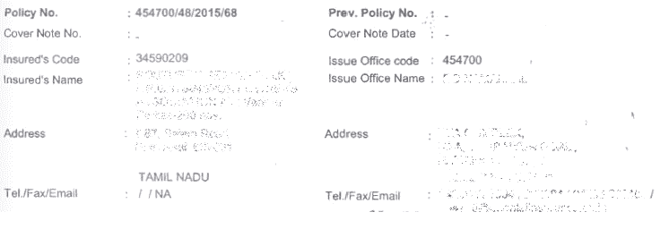
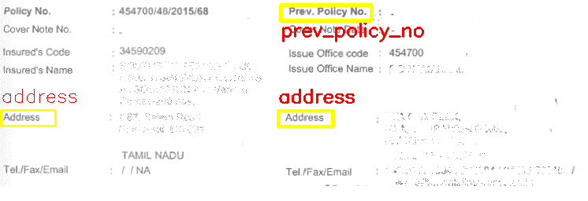

# Python |使用模板匹配的文档字段检测

> 原文:[https://www . geesforgeks . org/python-document-field-detection-use-template-matching/](https://www.geeksforgeeks.org/python-document-field-detection-using-template-matching/)

模板匹配是一种图像处理技术，用于寻找大图像的小部分/模板的位置。该技术广泛应用于产品质量、车辆跟踪、机器人等目标检测项目。

在本文中，我们将学习如何使用模板匹配来检测文档图像中的相关字段。

**解决方案** :
以上任务可以使用模板匹配来实现。裁剪出字段图像，并使用裁剪后的字段图像和文档图像应用模板匹配。该算法简单，但可复制成复杂的版本，以解决属于特定领域的文档图像的场检测和定位问题。

**接近**:

*   从主文档中剪切/裁剪字段图像，并将其用作单独的模板。
*   定义/调整不同字段的阈值。
*   使用 OpenCV 功能 **`cv2.matchTemplate()`** 为每个裁剪的字段模板应用模板匹配
*   使用从模板匹配中获取的矩形坐标绘制边界框。
*   可选:增强字段模板并微调阈值，以改善不同文档图像的结果。

**输入图像:**


**输出图像:**


下面是 Python 代码:

```
# importing libraries
import numpy as np
import imutils
import cv2

field_threshold = { "prev_policy_no" : 0.7,
                    "address"        : 0.6,
                  }

# Function to Generate bounding
# boxes around detected fields
def getBoxed(img, img_gray, template, field_name = "policy_no"):

    w, h = template.shape[::-1] 

    # Apply template matching
    res = cv2.matchTemplate(img_gray, template,
                           cv2.TM_CCOEFF_NORMED)

    hits = np.where(res >= field_threshold[field_name])

    # Draw a rectangle around the matched region. 
    for pt in zip(*hits[::-1]): 
        cv2.rectangle(img, pt, (pt[0] + w, pt[1] + h),
                                    (0, 255, 255), 2)

        y = pt[1] - 10 if pt[1] - 10 > 10 else pt[1] + h + 20

        cv2.putText(img, field_name, (pt[0], y),
            cv2.FONT_HERSHEY_SIMPLEX, 0.8, (0, 0, 255), 1)

    return img

# Driver Function
if __name__ == '__main__':

    # Read the original document image
    img = cv2.imread('doc.png')

    # 3-d to 2-d conversion
    img_gray = cv2.cvtColor(img, cv2.COLOR_BGR2GRAY)

    # Field templates
    template_add = cv2.imread('doc_address.png', 0)
    template_prev = cv2.imread('doc_prev_policy.png', 0)

    img = getBoxed(img.copy(), img_gray.copy(),
                       template_add, 'address')

    img = getBoxed(img.copy(), img_gray.copy(),
                   template_prev, 'prev_policy_no')

    cv2.imshow('Detected', img)
```

**使用模板匹配的优势**:

*   计算成本低。
*   易于使用，可针对不同的用例进行修改。
*   在文档数据稀缺的情况下给出好的结果。

**缺点**:

*   与使用深度学习的分割技术相比，结果不是非常准确。
*   缺少重叠模式问题解决方案。