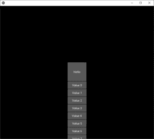

# Python | kivy 中的下拉列表

> 原文:[https://www.geeksforgeeks.org/python-dropdown-list-in-kivy/](https://www.geeksforgeeks.org/python-dropdown-list-in-kivy/)

[Kivy](https://www.geeksforgeeks.org/kivy-tutorial/) 是 Python 中独立于平台的 GUI 工具。因为它可以在安卓、IOS、linux 和 Windows 等平台上运行。它基本上是用来开发安卓应用程序的，但并不意味着它不能在桌面应用程序上使用。

> 👉🏽 [Kivy 教程–通过示例学习 Kivy](https://www.geeksforgeeks.org/kivy-tutorial/)。

### dropdownlist

dop-down 列表可以与自定义小部件一起使用。它允许您在显示的小部件下显示小部件列表。与其他工具包不同，小部件列表可以包含任何类型的小部件:简单的按钮、图像等。

下拉列表的定位是完全自动的:我们将始终尝试以用户可以选择列表中的项目的方式放置下拉列表。

制作下拉列表时要记住的一些要点:

*   添加小部件时，我们需要手动指定高度(禁用 size_hint_y)，这样下拉菜单就可以计算它需要的面积。*   All the buttons within the dropdown list will trigger the dropdown DropDown.select() method. After being called, the main button text will display the selection of the dropdown.

    > 要使用此小部件，您必须导入:
    > 
    > 从 kivy . uix . down 导入 DoWn

    ```
    Basic Approach:
    1) import kivy
    2) import kivy App
    3) import dropdown list
    4) import button
    5) set minimum version(optional)
    6) import runTouchApp
    7) Create dropdown
    8) create runtouchApp method 
       which takes widget as an argument
       to run the App
    ```

    **方法的实施–**

    ```
    # Program to explain how to create drop-down in kivy 

    # import kivy module    
    import kivy  

    # base Class of your App inherits from the App class.    
    # app:always refers to the instance of your application   
    from kivy.app import App 

    # this restrict the kivy version i.e  
    # below this kivy version you cannot  
    # use the app or software  
    kivy.require('1.9.0') 

    # Importing Drop-down from the module to use in the program
    from kivy.uix.dropdown import DropDown

    # The Button is a Label with associated actions
    # that are triggered when the button is pressed
    # (or released after a click / touch)
    from kivy.uix.button import Button

    # another way used to run kivy app 
    from kivy.base import runTouchApp

    # create a dropdown with 10 buttons
    dropdown = DropDown()
    for index in range(10):

        # Adding button in drop down list
        btn = Button(text ='Value % d' % index, size_hint_y = None, height = 40)

        # binding the button to show the text when selected
        btn.bind(on_release = lambda btn: dropdown.select(btn.text))

        # then add the button inside the dropdown
        dropdown.add_widget(btn)

    # create a big main button
    mainbutton = Button(text ='Hello', size_hint =(None, None), pos =(350, 300))

    # show the dropdown menu when the main button is released
    # note: all the bind() calls pass the instance of the caller 
    # (here, the mainbutton instance) as the first argument of the callback
    # (here, dropdown.open.).
    mainbutton.bind(on_release = dropdown.open)

    # one last thing, listen for the selection in the 
    # dropdown list and assign the data to the button text.
    dropdown.bind(on_select = lambda instance, x: setattr(mainbutton, 'text', x))

    # runtouchApp:
    # If you pass only a widget in runtouchApp(), a Window will
    # be created and your widget will be added to the window
    # as the root widget.
    runTouchApp(mainbutton)
    ```

    **输出:**

    **影像 1:**
    

    **图像 2:**
    