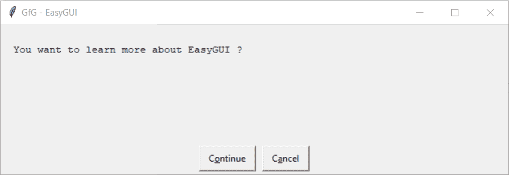

# Python EasyGUI–继续取消框

> 原文:[https://www . geesforgeks . org/python-easy GUI-continue-cancel-box/](https://www.geeksforgeeks.org/python-easygui-continue-cancel-box/)

**continue cancel Box :** 用于在 EasyGUI 中显示一个有两个选项 continue 或 Cancel 的窗口，可以在需要显示两个选项 Continue 或 Cancel 的地方使用，例如当我们想要确认选项时，如果按下 Continue，应用程序将向前移动，否则将被终止，下面是 Continue Cancel Box 的外观


> 为了做到这一点，我们将使用`msgbox`方法
> 
> **语法:** ccbox(消息、标题、选项)
> 
> **参数:**需要 3 个参数，第一个字符串即要显示的消息/信息，第二个字符串即窗口标题，第三个是正好有两个值的列表，这是继续和取消的两个选项
> 
> **返回:**如果按下继续，则返回真，否则返回假

**示例:**
在这里我们将创建一个继续取消框，当任何按钮被按下时它将在屏幕上显示具体的消息，下面是实现

```
# importing easygui module
from easygui import *

# message / information to be displayed on the screen
message = "You want to learn more about EasyGUI ?"

# title of the window
title = "GfG - EasyGUI"

# creating a continue cancel box
output = ccbox(message, title)

# if user pressed continue
if output:

    # message / information to be displayed on the screen
    message = "Go to GeeksforGeeks to learn more about EasyGUI"

    # title of the window
    title = "GfG - EasyGUI"

    # creating a message box
    msg = msgbox(message, title)

# if user pressed cancel
else:

    # message / information to be displayed on the screen
    message = "Ok No Problem"

    # title of the window
    title = "GfG - EasyGUI"

    # creating a message box
    msg = msgbox(message, title)
```

**输出:**

<video class="wp-video-shortcode" id="video-479807-1" width="665" height="197" preload="metadata" controls=""><source type="video/mp4" src="https://media.geeksforgeeks.org/wp-content/uploads/20200903005137/GfG-EasyGUI-2020-09-03-00-51-02.mp4?_=1">[https://media.geeksforgeeks.org/wp-content/uploads/20200903005137/GfG-EasyGUI-2020-09-03-00-51-02.mp4](https://media.geeksforgeeks.org/wp-content/uploads/20200903005137/GfG-EasyGUI-2020-09-03-00-51-02.mp4)</video>
<video class="wp-video-shortcode" id="video-479807-2" width="665" height="197" preload="metadata" controls=""><source type="video/mp4" src="https://media.geeksforgeeks.org/wp-content/uploads/20200903005154/GfG-EasyGUI-2020-09-03-00-51-13.mp4?_=2">[https://media.geeksforgeeks.org/wp-content/uploads/20200903005154/GfG-EasyGUI-2020-09-03-00-51-13.mp4](https://media.geeksforgeeks.org/wp-content/uploads/20200903005154/GfG-EasyGUI-2020-09-03-00-51-13.mp4)</video>

**另一个例子:**
在这里我们将为取消和继续按钮创建一个带有新文本的继续取消框，当任何按钮被按下时它将在屏幕上显示具体的消息，下面是实现

```
# importing easygui module
from easygui import *

# message / information to be displayed on the screen
message = "You want to learn more about EasyGUI ?"

# title of the window
title = "GfG - EasyGUI"

# button names
choices = ["Let's Go", "End This !"]

# creating a continue cancel box
output = ccbox(message, title, choices)

# if user pressed continue
if output:

    # message / information to be displayed on the screen
    message = "Go to GeeksforGeeks to learn more about EasyGUI"

    # title of the window
    title = "GfG - EasyGUI"

    # creating a message box
    msg = msgbox(message, title)

# if user pressed cancel
else:

    # message / information to be displayed on the screen
    message = "Ok No Problem"

    # title of the window
    title = "GfG - EasyGUI"

    # creating a message box
    msg = msgbox(message, title)
```

**输出:**

<video class="wp-video-shortcode" id="video-479807-3" width="665" height="197" preload="metadata" controls=""><source type="video/mp4" src="https://media.geeksforgeeks.org/wp-content/uploads/20200903005426/GfG-EasyGUI-2020-09-03-00-53-59.mp4?_=3">[https://media.geeksforgeeks.org/wp-content/uploads/20200903005426/GfG-EasyGUI-2020-09-03-00-53-59.mp4](https://media.geeksforgeeks.org/wp-content/uploads/20200903005426/GfG-EasyGUI-2020-09-03-00-53-59.mp4)</video>
<video class="wp-video-shortcode" id="video-479807-4" width="665" height="197" preload="metadata" controls=""><source type="video/mp4" src="https://media.geeksforgeeks.org/wp-content/uploads/20200903005154/GfG-EasyGUI-2020-09-03-00-51-13.mp4?_=4">[https://media.geeksforgeeks.org/wp-content/uploads/20200903005154/GfG-EasyGUI-2020-09-03-00-51-13.mp4](https://media.geeksforgeeks.org/wp-content/uploads/20200903005154/GfG-EasyGUI-2020-09-03-00-51-13.mp4)</video>