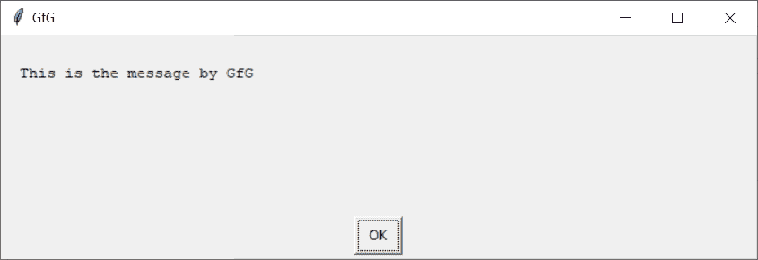

# Python EasyGUI–消息框

> 哎哎哎:# t0]https://www . geeksforgeeks . org/python-easy GUI-message box/

**消息框:**用于在 EasyGUI 中显示一个有消息或信息的窗口，可以在需要显示一些消息或重要信息的地方使用，它包含消息和一个“确定”按钮，按下后关闭消息，下图是消息框的样子



**EasyGUI** 是一个用 Python 进行非常简单、非常容易的 GUI 编程的模块。EasyGUI 与其他 GUI 生成器的不同之处在于 EasyGUI 不是事件驱动的。相反，所有的图形用户界面交互都是通过简单的函数调用来调用的。与其他复杂的图形用户界面不同，易趣是迄今为止最简单的图形用户界面。EasyGUI 依赖于 Tkinter 模块。

> 为此，我们将使用 msgbox 方法
> **语法:** msgbox(消息，标题，ok_button_text)
> **参数:**它需要 3 个参数，第一个字符串即要显示的消息/信息，第二个字符串即窗口标题，第三个字符串即 ok 按钮的显示文本
> **返回:**它返回 OK 按钮的文本

**示例:**
在这里我们将创建一个有消息的消息框，并将设置 OK 按钮的显示文本，下面是实现

## 蟒蛇 3

```py
# importing easygui module
from easygui import *

# message / information to be displayed on the screen
message = "This is a Message Box in EasyGUI"

# title of the window
title = "GfG - EasyGUI"

# text of the Ok button
ok_btn_txt = "Continue"

# creating a message box
output = msgbox(message, title, ok_btn_txt)

# printing the output
print("User pressed  : " + output)
```

**输出:**

<video class="wp-video-shortcode" id="video-479805-1" width="640" height="360" preload="metadata" controls=""><source type="video/mp4" src="https://media.geeksforgeeks.org/wp-content/uploads/20200903001623/GfG-EasyGUI-2020-09-03-00-15-43.mp4?_=1">[https://media.geeksforgeeks.org/wp-content/uploads/20200903001623/GfG-EasyGUI-2020-09-03-00-15-43.mp4](https://media.geeksforgeeks.org/wp-content/uploads/20200903001623/GfG-EasyGUI-2020-09-03-00-15-43.mp4)</video>

```py
User pressed  : Continue
```

**另一个例子**
在这里我们将创建一个有消息和标题的窗口，但是不改变 ok 按钮
的文本

## 蟒蛇 3

```py
# importing easygui module
from easygui import *

# message / information to be displayed on the screen
message = "This is a Message Box in EasyGUI (GeeksforGeeks)"

# title of the window
title = "GfG - EasyGUI"

# creating a message box
output = msgbox(message, title)

# printing the output
print("User pressed  : " + output)
```

**输出:**

<video class="wp-video-shortcode" id="video-479805-2" width="640" height="360" preload="metadata" controls=""><source type="video/mp4" src="https://media.geeksforgeeks.org/wp-content/uploads/20200903001838/GfG-EasyGUI-2020-09-03-00-17-09.mp4?_=2">[https://media.geeksforgeeks.org/wp-content/uploads/20200903001838/GfG-EasyGUI-2020-09-03-00-17-09.mp4](https://media.geeksforgeeks.org/wp-content/uploads/20200903001838/GfG-EasyGUI-2020-09-03-00-17-09.mp4)</video>

```py
User pressed  : OK
```