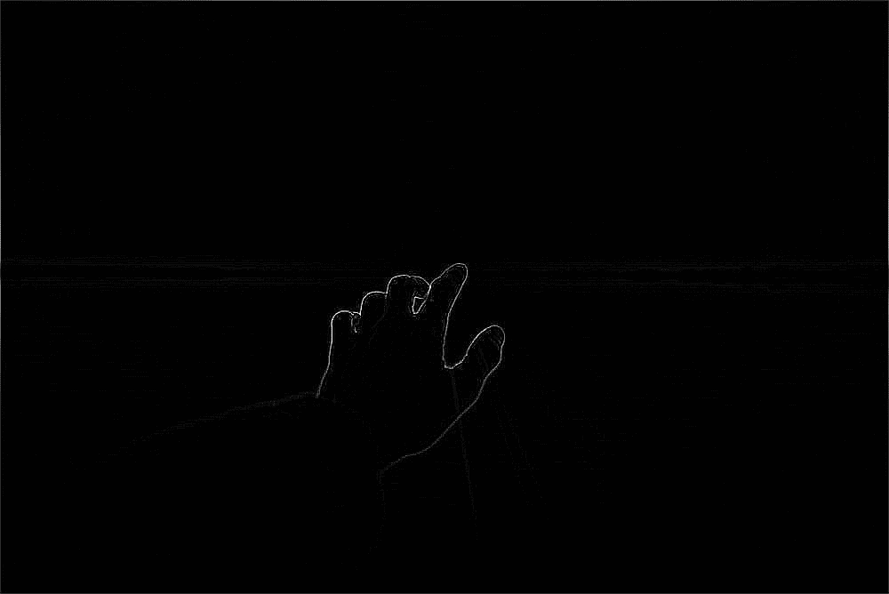

# Python–使用枕头进行边缘检测

> 原文:[https://www . geeksforgeeks . org/python-边缘检测-使用-枕头/](https://www.geeksforgeeks.org/python-edge-detection-using-pillow/)

边缘检测是一门图像处理学科，它结合了数学方法来寻找数字图像中的边缘。边缘检测通过在数字图像上运行过滤器/内核在内部工作，它检测图像区域中的不连续性，如像素的亮度/强度值的明显变化。

**边缘检测有两种形式:**

*   基于搜索的边缘检测(一阶导数)
*   基于过零的边缘检测(二阶导数)

**一些常见的边缘检测方法有:**

*   **拉普拉斯算子或基于拉普拉斯的边缘检测(二阶导数)**
*   **Canny 边缘检测器(一阶导数)**
*   **普雷维特算子(一阶导数)**
*   **索贝尔算子(一阶导数)**

**我们将实现一个拉普拉斯算子，以便在后面的例子中加入边缘检测。为此，我们将使用`pillow`库。要安装库，请在命令行中执行以下命令:**

```py
pip install pillow 
```

****注意:-** 一些 Linux 发行版倾向于在其上预装 Python 和抱枕。**

**有两种方法可以在图像上实现边缘检测。在第一种方法中，我们将使用枕头库中提供的内置方法(`ImageFilter.FIND_EDGES`)进行边缘检测。在第二个例子中，我们将使用`PIL.ImageFilter.Kernel()`创建一个拉普拉斯过滤器，然后使用该过滤器进行边缘检测。**

****拉普拉斯核:-****

****

****样本图像:-****

****

****方法 1:****

## **蟒蛇 3**

```py
from PIL import Image, ImageFilter

# Opening the image (R prefixed to string
# in order to deal with '\' in paths)
image = Image.open(r"Sample.png")

# Converting the image to grayscale, as edge detection 
# requires input image to be of mode = Grayscale (L)
image = image.convert("L")

# Detecting Edges on the Image using the argument ImageFilter.FIND_EDGES
image = image.filter(ImageFilter.FIND_EDGES)

# Saving the Image Under the name Edge_Sample.png
image.save(r"Edge_Sample.png")
```

****输出(Edge_Sample.png):****

****

****说明:-****

**首先，我们使用`Image.open()`创建图像的图像对象。然后，我们将图像颜色模式转换为灰度，因为拉普拉斯算子的输入处于灰度模式(通常)。然后，我们通过指定`ImageFilter.FIND_EDGES`参数将图像传递给`Image.filter()`函数，该函数又在图像上运行边缘检测内核。上述函数的输出导致图像的白色阴影具有高强度变化(边缘)，而图像的其余部分为黑色。**

****方法二:****

## **蟒蛇 3**

```py
from PIL import Image, ImageFilter

img = Image.open(r"sample.png")

# Converting the image to grayscale, as Sobel Operator requires
# input image to be of mode Grayscale (L)
img = img.convert("L")

# Calculating Edges using the passed laplican Kernel
final = img.filter(ImageFilter.Kernel((3, 3), (-1, -1, -1, -1, 8,
                                          -1, -1, -1, -1), 1, 0))

final.save("EDGE_sample.png")
```

****输出(EDGE_sample.png):****

****

****说明:-****

**首先，我们使用`Image.open()`创建图像的图像对象。然后，我们将图像颜色模式转换为灰度，因为拉普拉斯算子的输入处于灰度模式(通常)。然后，我们通过在函数内部指定我们的运算符/内核作为参数，将图像传递给`Image.filter()`函数。内核是通过使用`ImageFilter.Kernel((3, 3), (-1, -1, -1, -1, 8, -1, -1, -1, -1), 1, 0))`来指定的，它使用值 *(-1，-1，-1，-1，8，-1，-1，-1，-1，-1)，*(如拉普拉斯内核图像中所述)创建一个 3×3 内核(3 像素宽，3 像素长)。`1`参数(在内核之后)代表 Scale 值，它在每次内核操作之后划分最终值，因此我们将该值设置为 1，因为我们不希望对最终值进行任何划分。`0`参数(在比例值之后)是在除以比例值之后相加的偏移量。我们已经将该值设置为 0，因为我们不希望在核卷积之后最终强度值有任何增量。上述函数的输出导致图像的白色阴影具有高强度变化(边缘)，而图像的其余部分为黑色。**

****附录–****

**这两个程序产生了相同的结果。原因是内置函数`ImageFilter.FIND_EDGE`在内部使用了一个 3×3 大小的拉普拉斯核/算子。因此我们得到了相同的结果。使用内核而不是依赖内置函数的好处是，我们可以根据自己的需要定义内核，内核可能在库中，也可能不在库中。比如我们可以为模糊、锐化、边缘检测(使用其他内核)等创建一个内核。此外，我有意选择拉普拉斯算子，这样我们就可以保持结果的一致性。**

*****使用拉普拉斯的好处:-***
快速而体面的结果。像索贝尔(一阶导数)这样的其他常见边缘检测器在计算上更昂贵，因为它们需要在两个方向上找到梯度，然后对结果进行归一化。**

*****使用拉普拉斯的缺点:-***
用拉普拉斯核进行卷积会导致输出中出现大量噪声。这个问题是通过其他边缘检测方法解决的，如 Sobel，Perwitt 算子等。因为它们内置了高斯模糊核。这减少了从输入图像获得的噪声。它们还导致更精确的边缘检测，因为寻找它们需要更高的计算量。**