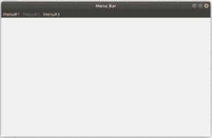

# Python–wx 中的 EnableTop()函数。菜单栏

> 原文:[https://www . geesforgeks . org/python-enable top-function-in-wx-menu bar/](https://www.geeksforgeeks.org/python-enabletop-function-in-wx-menubar/)

在本文中，我们将了解 wx 的 EnableTop()函数。wxPython 的菜单栏类。b/w Enable()和 EnableTop()的唯一区别是 EnableTop()用于使菜单栏中的整个菜单不可选择或可点击。

> **语法:**
> 
> ```
> wx.MenuBar.EnableTop(self, id, enable)
> 
> ```
> 
> **参数:**
> 
> | 参数 | 输入类型 | 描述 |
> | --- | --- | --- |
> | 刷卡机 | （同 Internationalorganizations）国际组织 | 菜单的位置，从零开始。 |
> | 使能够 | 弯曲件 | 如果为真，则启用菜单；如果为假，则禁用菜单。 |

**代码示例:**

```
import wx

class Example(wx.Frame):

    def __init__(self, *args, **kwargs):
        super(Example, self).__init__(*args, **kwargs)

        self.InitUI()

    def InitUI(self):
        # create MenuBar using MenuBar() function
        menubar = wx.MenuBar()
        # add menu to Menuitem
        fileMenu = wx.Menu()
        fileMenu2 = wx.Menu()
        fileMenu3 = wx.Menu()
        menubar.Append(fileMenu, '&Menu# 1')
        menubar.Append(fileMenu2, '&Menu# 2')
        menubar.Append(fileMenu3, '&Menu# 3')

        self.SetMenuBar(menubar)
        self.SetSize((300, 200))
        self.SetTitle('Menu Bar')
        # Disable Menu# 2 in menu bar
        menubar.EnableTop(1, False)

def main():

    app = wx.App()
    ex = Example(None)
    ex.Show()
    app.MainLoop()

if __name__ == '__main__':
    main()
```

