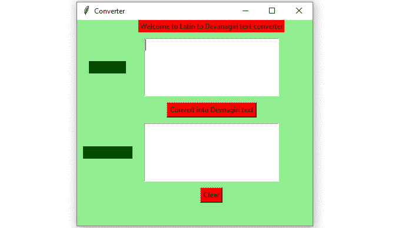
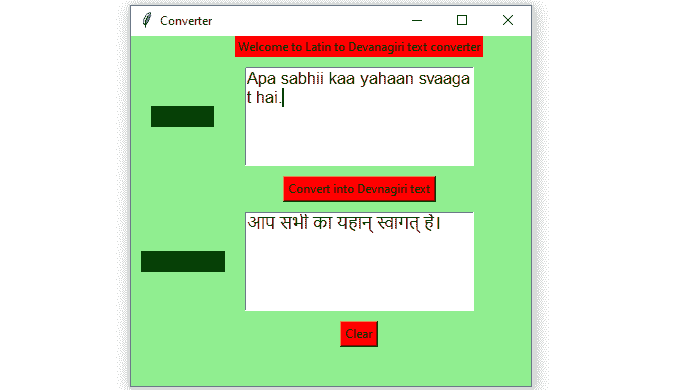

# Python–英语(拉丁语)到印地语(Devanagiri)文本转换器图形用户界面，使用 Tkinter

> 原文:[https://www . geesforgeks . org/python-English-Latin-to-Hindi-devanagiri-text-converter-GUI-use-tkinter/](https://www.geeksforgeeks.org/python-english-latin-to-hindi-devanagiri-text-convertor-gui-using-tkinter/)

**先决条件:**[tkinter 简介](https://www.geeksforgeeks.org/python-gui-tkinter/) | [从英语到印度语言的文本音译–使用印度语音译](https://www.geeksforgeeks.org/text-transliteration-from-english-to-indian-languages-using-indic-transliteration/)
Python 为开发图形用户界面提供了多个选项。在所有的 GUI 方法中，tkinter 是最常用的方法。它是 Python 附带的 Tk 图形用户界面工具包的标准 Python 接口。带有 tkinter 输出的 Python 是创建 GUI 应用程序最快最简单的方法。现在，这取决于开发人员的想象力或必要性，他/她想使用这个工具包开发什么。

> 要创建 tkinter:
> 
> *   导入模块–tkinter
> *   创建主窗口(容器)
> *   向主窗口添加任意数量的小部件。
> *   在小部件上应用事件触发器。

让我们创建一个基于图形用户界面的英语(拉丁语)到印地语(梵文)文本转换器应用程序，可以将用户给出的文本输入转换成梵文文本。

下面是实现:

## 蟒蛇 3

```
# import sanscript class from the indic_transliteration module
from indic_transliteration import sanscript

# import transliterate method from sanscript
# class of the indic_transliteration module
from indic_transliteration.sanscript import transliterate

# import all functions from the tkinter 
from tkinter import *

# Function to clear both the text areas
def clearAll() :
    # whole content of text area  is deleted
    text1_field.delete(1.0, END)
    text2_field.delete(1.0, END)

# Function to convert into Devanagari text
def convert() :

    # get a whole input content from text box
    # ignoring \n from the text box content
    input_text = text1_field.get("1.0", "end")[:-1]

    # converted into the given devanagari
    # transliterated text
    output_text = transliterate(input_text, sanscript.ITRANS,
                                            sanscript.DEVANAGARI)

    text2_field.insert('end -1 chars', output_text)

# Driver code
if __name__ == "__main__" :

    # Create a GUI window
    root = Tk()

    # Set the background colour of GUI window 
    root.configure(background = 'light green') 

    # Set the configuration of GUI window (WidthxHeight)
    root.geometry("400x350") 

    # set the name of tkinter GUI window 
    root.title("Converter")

    # Create Welcome to Latin to Devanagiri text converter
    headlabel = Label(root, text = 'Welcome to Latin to Devanagiri text converter', 
                      fg = 'black', bg = "red") 

    # Create a " Latin Text " label 
    label1 = Label(root, text = " Latin Text ",
                 fg = 'black', bg = 'dark green')

    # Create a " Devanagiri Text " label 
    label2 = Label(root, text = " Devnagiri Text", 
                   fg = 'black', bg = 'dark green') 

    # grid method is used for placing 
    # the widgets at respective positions 
    # in table like structure .  
    headlabel.grid(row = 0, column = 1)

    # padx keyword argument used to set padding along x-axis .
    # pady keyword argument used to set padding along y-axis .
    label1.grid(row = 1, column = 0, padx = 10, pady = 10) 
    label2.grid(row = 3, column = 0, padx = 10, pady = 10)

    # Create a text area box 
    # for filling or typing the information. 
    text1_field = Text(root, height = 5, width = 25, font = "lucida 13")
    text2_field = Text(root, height = 5, width = 25, font = "lucida 13")

    # padx keyword argument used to set padding along x-axis .
    # pady keyword argument used to set padding along y-axis . 
    text1_field.grid(row = 1, column = 1, padx = 10, pady = 10) 
    text2_field.grid(row = 3, column = 1, padx = 10, pady = 10)

    # Create a Convert Button and attached 
    # with convert function 
    button1 = Button(root, text = "Convert into Devnagiri text",
                     bg = "red", fg = "black", command = convert)

    button1.grid(row = 2, column = 1)

    # Create a Clear Button and attached 
    # with clearAll function 
    button2 = Button(root, text = "Clear", bg = "red", 
                     fg = "black", command = clearAll)

    button2.grid(row = 4, column = 1)

    # Start the GUI 
    root.mainloop() 
```

**输出:**



