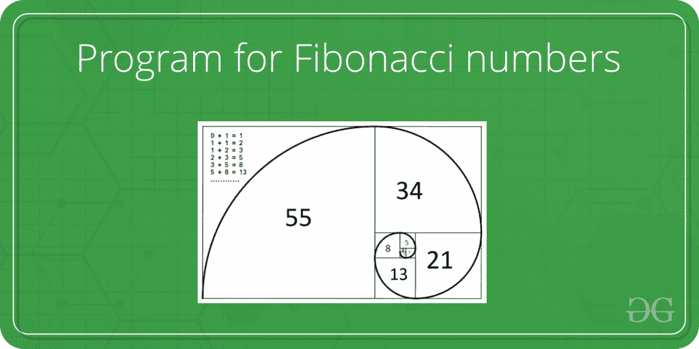

# Python |使用 lambda

查找斐波那契数列 up n

> 原文:[https://www . geesforgeks . org/python-find-Fibonacci-series-upto-n-using-lambda/](https://www.geeksforgeeks.org/python-find-fibonacci-series-upto-n-using-lambda/)

斐波那契数列是下列整数序列中的数字。

0, 1, 1, 2, 3, 5, 8, 13, 21, 34, 55, 89, 144, …… ..

在数学术语中，斐波那契数列 Fn 由递归关系定义

> F<sub>n</sub>= F<sub>n-1</sub>+F<sub>n-2</sub>，种子值 F <sub>0</sub> = 0，F <sub>1</sub> = 1。



**用 lambda 函数求斐波那契数列。**

**代码#1:使用λ和归约方法**

```py
from functools import reduce

fib = lambda n: reduce(lambda x, _: x+[x[-1]+x[-2]],
                                 range(n-2), [0, 1])

print(fib(5))
```

**Output:**

```py
[0, 1, 1, 2, 3]

```

**说明:**

取前两个参数的列表是 0 和 1，像**x[-1】**一样添加，即 0 和**x[-2】**即 1，并追加到变量 x，有一个类型转换到列表，由于 **`reduce()`** 方法，相同的函数调用，由于*范围*函数，这个时间参数发生变化，然后将这个添加到以前的结果中，并再次存储到列表中。

**代码#2:使用λ和映射功能**

```py
def fibonacci(count):
    fib_list = [0, 1]

    any(map(lambda _: fib_list.append(sum(fib_list[-2:])),
                                         range(2, count)))

    return fib_list[:count]

print(fibonacci(10))
```

**Output:**

```py
[0, 1, 1, 2, 3, 5, 8, 13, 21, 34]

```

**说明:**
我们正在取已经有 0 和 1 的列表 **fib_list** 。然后在下一次迭代中，这将被用作输入，并且它们的求和结果将被追加到列表中。