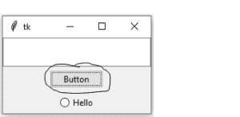

# Python | focus_set()和 focus_get()方法

> 原文:[https://www . geesforgeks . org/python-focus _ set-and-focus _ get-method/](https://www.geeksforgeeks.org/python-focus_set-and-focus_get-method/)

Tkinter 有许多小部件可以在任何图形用户界面中提供功能。它还支持各种通用的小部件方法，这些方法可以应用于任何小部件。
`focus_get()``focus_set()`方法也是通用的 widget 方法。它们也可以应用于`Tk()`法。

## focus_set()方法-

当且仅当主窗口聚焦时，此方法用于将焦点设置在所需的小部件上。

**语法:**

```
widget.focus_set()

```

下面是 Python 程序——

```
# Importing tkinter module
# and all functions
from tkinter import * 
from tkinter.ttk import *

# creating master window
master = Tk()

# Entry widget
e1 = Entry(master)
e1.pack(expand = 1, fill = BOTH)

# Button widget which currently has the focus
e2 = Button(master, text ="Button")

# here focus_set() method is used to set the focus
e2.focus_set()
e2.pack(pady = 5)

# Radiobuton widget
e3 = Radiobutton(master, text ="Hello")
e3.pack(pady = 5)

# Infinite loop
mainloop()
```

**输出:**


在上图中可以观察到有焦点。**为了更好的理解复制并运行以上程序**。

## focus_get()方法-

此方法返回当前具有焦点的小部件的名称。

**语法:**

```
master.focus_get()

```

**注意:**你可以用它搭配任何的小部件，高手在没必要。

下面是 Python 程序–

```
# Importing tkinter module
# and all functions
from tkinter import * 
from tkinter.ttk import *

# creating master window
master = Tk()

# This method is used to get
# the name of the widget
# which currently has the focus
# by clicking Mouse Button-1
def focus(event):
    widget = master.focus_get()
    print(widget, "has focus")

# Entry widget
e1 = Entry(master)
e1.pack(expand = 1, fill = BOTH)

# Button Widget
e2 = Button(master, text ="Button")
e2.pack(pady = 5)

# Radiobutton widget
e3 = Radiobutton(master, text ="Hello")
e3.pack(pady = 5)

# Here function focus() is binded with Mouse Button-1
# so every time you click mouse, it will call the
# focus method, defined above
master.bind_all("<Button-1>", lambda e: focus(e))

# infinite loop
mainloop()
```

**输出:**每次点击任意一个小部件或者如果点击鼠标按键-1 以上程序都会打印出有焦点的小部件的名称。为了更好地理解复制和运行上述程序。

```
.!radiobutton has focus
.!entry has focus
.!button has focus

```