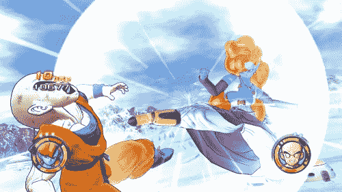
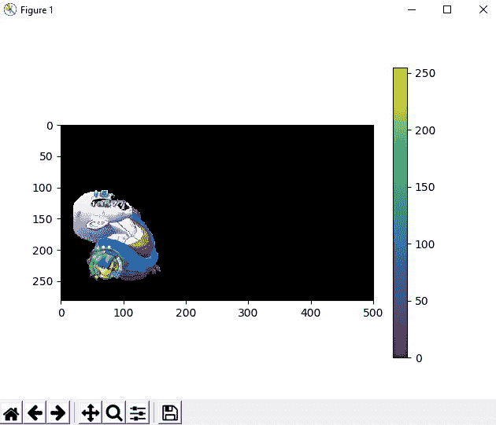

# Python |使用 Grabcut 算法提取图像中的前景

> 原文:[https://www . geeksforgeeks . org/python-前景-图像中提取-使用-grab cut-算法/](https://www.geeksforgeeks.org/python-foreground-extraction-in-an-image-using-grabcut-algorithm/)

让我们讨论一种从图像背景中提取前景的有效方法。这里的想法是找到前景，去掉背景。

**前景提取**是允许提取图像前景以进行进一步处理(如对象识别、跟踪等)的任何技术。这里用于前景提取的算法是 **GrabCut 算法**。在该算法中，根据前景绘制区域，在其上绘制矩形。这是包围我们主要物体的矩形。区域坐标取决于对前景遮罩的理解。但是这种分割并不完美，因为它可能已经将一些前景区域标记为背景，反之亦然。这个问题可以手动避免。这种前景提取技术的功能就像电影中的绿屏。

*   感兴趣区域由要执行的前景和背景的分割量决定，并由用户选择。ROI 之外的一切都被视为背景，变成黑色。投资回报率内部的因素仍然未知。
*   然后[高斯混合模型](https://www.geeksforgeeks.org/gaussian-mixture-model/) (GMM)用于前景和背景建模。然后，根据用户提供的数据，GMM 学习并创建未知像素的标签，并且根据颜色统计对每个像素进行聚类。
*   从这个像素分布生成一个图，其中像素被认为是节点，并且添加了两个附加节点，即源节点和宿节点。所有前景像素都连接到源节点，每个背景像素都连接到汇节点。将像素连接到源节点和结束节点的边的权重由像素在前景或背景中的概率来定义。
*   如果在像素颜色中发现巨大的不相似性，则低权重被分配给该边缘。然后应用该算法对图形进行分割。该算法将图分成两部分，在代价函数的帮助下分离源节点和汇节点，该代价函数是被分割的边的所有权重的总和。
*   分割后，连接到源节点的像素被标记为前景，连接到汇节点的像素被标记为背景。这个过程按照用户的指定进行多次迭代。这给了我们提取的前景。

这里使用的函数是 [cv2.grabCut()](https://docs.opencv.org/3.4/d7/d1b/group__imgproc__misc.html#ga909c1dda50efcbeaa3ce126be862b37f)

> **语法:** cv2.grabCut(图像、遮罩、矩形、backgroundModel、foregroundModel、iterationCount[、mode])
> 
> **参数:**
> 
> *   **图像:**输入 8 位 3 通道图像。
> *   **掩码:**输入/输出 8 位单通道掩码。当模式设置为 GC_INIT_WITH_RECT 时，掩码由函数初始化。其元素可能具有以下值之一:
>     *   **GC_BGD** 定义一个明显的背景像素。
>     *   **GC_FGD** 定义一个明显的前景(物体)像素。
>     *   **GC_PR_BGD** 定义一个可能的背景像素。
>     *   **GC_PR_FGD** 定义一个可能的前景像素。
> *   **矩形:**是包含分割对象的感兴趣区域。ROI 外部的像素被标记为明显的背景。该参数仅在模式==GC_INIT_WITH_RECT 时使用。
> *   **背景模型:**背景模型的临时数组。
> *   **前景模型:**前景模型的临时数组。
> *   **迭代计数:**算法在返回结果之前应该进行的迭代次数。请注意，可以使用模式==GC_INIT_WITH_MASK 或模式==GC_EVAL 进一步调用来优化结果。
> *   **模式:**定义运行模式。它可以是以下之一:
>     *   **GC _ INIT _ wit _ RECT**:函数使用提供的矩形初始化状态和掩码。之后，它运行迭代算法。
>     *   **GC_INIT_WITH_MASK** :函数使用提供的掩码初始化状态。请注意，GC_INIT_WITH_RECT 和 GC_INIT_WITH_MASK 可以组合使用。然后，用 GC_BGD 自动初始化感兴趣区域之外的所有像素。
>     *   **GC_EVAL** :该值表示算法应该刚刚恢复。

下面是实现:

```
# Python program to illustrate 
# foreground extraction using
# GrabCut algorithm

# organize imports
import numpy as np
import cv2
from matplotlib import pyplot as plt

# path to input image specified and 
# image is loaded with imread command
image = cv2.imread('image.jpg')

# create a simple mask image similar
# to the loaded image, with the 
# shape and return type
mask = np.zeros(image.shape[:2], np.uint8)

# specify the background and foreground model
# using numpy the array is constructed of 1 row
# and 65 columns, and all array elements are 0
# Data type for the array is np.float64 (default)
backgroundModel = np.zeros((1, 65), np.float64)
foregroundModel = np.zeros((1, 65), np.float64)

# define the Region of Interest (ROI)
# as the coordinates of the rectangle
# where the values are entered as
# (startingPoint_x, startingPoint_y, width, height)
# these coordinates are according to the input image
# it may vary for different images
rectangle = (20, 100, 150, 150)

# apply the grabcut algorithm with appropriate
# values as parameters, number of iterations = 3 
# cv2.GC_INIT_WITH_RECT is used because
# of the rectangle mode is used 
cv2.grabCut(image, mask, rectangle,  
            backgroundModel, foregroundModel,
            3, cv2.GC_INIT_WITH_RECT)

# In the new mask image, pixels will 
# be marked with four flags 
# four flags denote the background / foreground 
# mask is changed, all the 0 and 2 pixels 
# are converted to the background
# mask is changed, all the 1 and 3 pixels
# are now the part of the foreground
# the return type is also mentioned,
# this gives us the final mask
mask2 = np.where((mask == 2)|(mask == 0), 0, 1).astype('uint8')

# The final mask is multiplied with 
# the input image to give the segmented image.
image = image * mask2[:, :, np.newaxis]

# output segmented image with colorbar
plt.imshow(image)
plt.colorbar()
plt.show()
```

**输入图像:**
[](https://media.geeksforgeeks.org/wp-content/uploads/Ab8033da6e4f8ab6eef2a7397cd84d68-500x281.jpg)

**输出:**
[](https://media.geeksforgeeks.org/wp-content/uploads/grabcut.jpg) 
这里我们拍摄了一张大小为 500X281 的输入图像，并据此决定了矩形的坐标。输出图像显示了图像左侧的对象如何成为前景的一部分，以及如何减去背景。