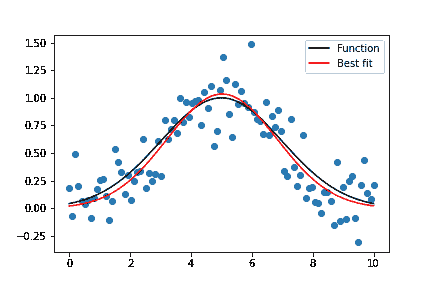

# Python-高斯拟合

> 原文:[https://www.geeksforgeeks.org/python-gaussian-fit/](https://www.geeksforgeeks.org/python-gaussian-fit/)

## 什么是正态分布或高斯分布？

当我们绘制像直方图这样的数据集时，图表的形状就是我们所说的分布。最常见的连续值形状是钟形曲线，也称为高斯或正态分布。

它以德国数学家卡尔·弗里德里希·高斯的名字命名。一些遵循高斯分布的常见示例数据集是体温、人的身高、汽车里程、智商分数。

让我们尝试生成理想的正态分布，并使用 Python 绘制它。

### 如何用 Python 绘制高斯分布

我们有像 Numpy、scipy 和 matplotlib 这样的库来帮助我们绘制理想的法线曲线。

## 蟒蛇 3

```
import numpy as np
import scipy as sp
from scipy import stats
import matplotlib.pyplot as plt

## generate the data and plot it for an ideal normal curve

## x-axis for the plot
x_data = np.arange(-5, 5, 0.001)

## y-axis as the gaussian
y_data = stats.norm.pdf(x_data, 0, 1)

## plot data
plt.plot(x_data, y_data)
```

**输出:**


x 轴上的点是观测值，y 轴是每个观测值的可能性。

我们使用 *np.arange()* 在(-5，5)范围内生成了规则间隔的观测值。然后我们通过 norm.pdf()函数运行它，平均值为 0.0，标准偏差为 1，这返回了观察的可能性。0 左右的观测最常见，而-5.0 和 5.0 左右的观测很少。 ***pdf()*** 函数的技术术语是 ***概率密度函数。***

### **高斯函数:**

首先，让我们将数据拟合到高斯函数。我们的目标是找到最适合我们数据的 A 和 B 的值。首先，我们需要为高斯函数方程编写一个 python 函数。该函数应该接受自变量(x 值)和构成自变量的所有参数。

## 蟒蛇 3

```
#Define the Gaussian function
def gauss(x, H, A, x0, sigma):
    return H + A * np.exp(-(x - x0) ** 2 / (2 * sigma ** 2))
```

我们将使用 python 模块 ***中的函数 ***【曲线拟合】*** 来拟合我们的数据。它使用非线性最小二乘法将数据拟合成函数形式。您可以使用 Jupyter 笔记本或 ***scipy 在线文档*** 中的帮助功能，了解更多关于 ***curve_fit*** 的信息。***

**curve_fit** 函数有三个必需的输入:要拟合的函数、x 数据和 y 数据。有两种输出。第一个是参数最佳值的数组。第二个是参数的估计协方差矩阵，从中可以计算参数的标准误差。

**例 1:**

## 蟒蛇 3

```
from __future__ import print_function
import numpy as np
import matplotlib.pyplot as plt
from scipy.optimize import curve_fit
xdata = [ -10.0, -9.0, -8.0, -7.0, -6.0, -5.0, -4.0, -3.0, -2.0, -1.0, 0.0, 1.0, 2.0, 3.0, 4.0, 5.0, 6.0, 7.0, 8.0, 9.0, 10.0]
ydata = [1.2, 4.2, 6.7, 8.3, 10.6, 11.7, 13.5, 14.5, 15.7, 16.1, 16.6, 16.0, 15.4, 14.4, 14.2, 12.7, 10.3, 8.6, 6.1, 3.9, 2.1]

# Recast xdata and ydata into numpy arrays so we can use their handy features
xdata = np.asarray(xdata)
ydata = np.asarray(ydata)
plt.plot(xdata, ydata, 'o')

# Define the Gaussian function
def Gauss(x, A, B):
    y = A*np.exp(-1*B*x**2)
    return y
parameters, covariance = curve_fit(Gauss, xdata, ydata)

fit_A = parameters[0]
fit_B = parameters[1]

fit_y = Gauss(xdata, fit_A, fit_B)
plt.plot(xdata, ydata, 'o', label='data')
plt.plot(xdata, fit_y, '-', label='fit')
plt.legend()
```


**例 2:**

## 蟒蛇 3

```
import numpy as np
from scipy.optimize import curve_fit
import matplotlib.pyplot as mpl

# Let's create a function to model and create data
def func(x, a, x0, sigma):
    return a*np.exp(-(x-x0)**2/(2*sigma**2))

# Generating clean data
x = np.linspace(0, 10, 100)
y = func(x, 1, 5, 2)

# Adding noise to the data
yn = y + 0.2 * np.random.normal(size=len(x))

# Plot out the current state of the data and model
fig = mpl.figure()
ax = fig.add_subplot(111)
ax.plot(x, y, c='k', label='Function')
ax.scatter(x, yn)

# Executing curve_fit on noisy data
popt, pcov = curve_fit(func, x, yn)

#popt returns the best fit values for parameters of the given model (func)
print (popt)

ym = func(x, popt[0], popt[1], popt[2])
ax.plot(x, ym, c='r', label='Best fit')
ax.legend()
fig.savefig('model_fit.png')
```

**输出:**

