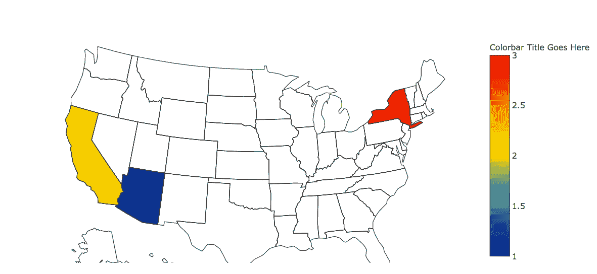

# Python |使用绘图进行地理绘图

> 原文:[https://www . geeksforgeeks . org/python-地理-绘图-使用-plotly/](https://www.geeksforgeeks.org/python-geographical-plotting-using-plotly/)

地理标绘用于世界地图以及一个国家下的州。主要用于数据分析师检查农业出口或可视化此类数据。

**plot**是一个 Python 库，用来设计图形，尤其是交互图形。它可以绘制各种图形和图表，如直方图、条形图、箱线图、展开图等。它主要用于数据分析以及财务分析。**剧情上**是一个交互式可视化库。

**袖扣**与熊猫进行剧情连接，直接创建数据框的图形和图表。**地名**用来描述美国的地理标绘。choropleth 用于绘制世界地图和其他许多地图。

**命令安装程序:**

```
pip install plotly 
```

下面是实现:

```
# Python program to plot 
# geographical data using plotly

# importing all necessary libraries
import plotly.plotly as py
import plotly.graph_objs as go
import pandas as pd

# some more libraries to plot graph
from plotly.offline import download_plotlyjs, init_notebook_mode, iplot, plot

# To establish connection
init_notebook_mode(connected = True)

# type defined is choropleth to
# plot geographical plots
data = dict(type = 'choropleth',

            # location: Arizoana, California, Newyork
            locations = ['AZ', 'CA', 'NY'],

            # States of USA
            locationmode = 'USA-states',

            # colorscale can be added as per requirement
            colorscale = 'Portland',

            # text can be given anything you like
            text = ['text 1', 'text 2', 'text 3'],
            z = [1.0, 2.0, 3.0],
            colorbar = {'title': 'Colorbar Title Goes Here'})

layout = dict(geo ={'scope': 'usa'})

# passing data dictionary as a list 
choromap = go.Figure(data = [data], layout = layout)

# plotting graph
iplot(choromap)
```

**输出:**
