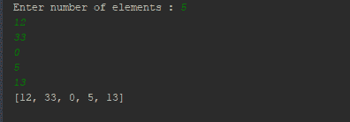
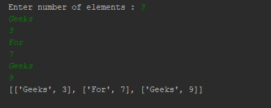
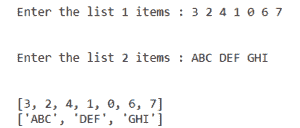

# Python |从用户处获取列表作为输入

> 原文:[https://www . geesforgeks . org/python-从用户处获取列表作为输入/](https://www.geeksforgeeks.org/python-get-a-list-as-input-from-user/)

我们经常会遇到需要从用户那里获取数字/字符串作为输入的情况。在本文中，我们将看到如何从用户那里获得一个列表作为输入。
**例:**

```py
Input : n = 4,  ele = 1 2 3 4
Output :  [1, 2, 3, 4]

Input : n = 6, ele = 3 4 1 7 9 6
Output : [3, 4, 1, 7, 9, 6]
```

**代码#1:** 基础示例

## 蟒蛇 3

```py
# creating an empty list
lst = []

# number of elements as input
n = int(input("Enter number of elements : "))

# iterating till the range
for i in range(0, n):
    ele = int(input())

    lst.append(ele) # adding the element

print(lst)
```

**输出:**



**代码#2:** 处理异常

## 蟒蛇 3

```py
# try block to handle the exception
try:
    my_list = []

    while True:
        my_list.append(int(input()))

# if the input is not-integer, just print the list
except:
    print(my_list)
```

**输出:**


**代码#3:** 使用地图()

## 蟒蛇 3

```py
# number of elements
n = int(input("Enter number of elements : "))

# Below line read inputs from user using map() function
a = list(map(int,input("\nEnter the numbers : ").strip().split()))[:n]

print("\nList is - ", a)
```

**输出:**


**代码#4:** 列表作为输入

## 蟒蛇 3

```py
lst = [ ]
n = int(input("Enter number of elements : "))

for i in range(0, n):
    ele = [input(), int(input())]
    lst.append(ele)

print(lst)
```

**输出:**



**代码#5:** 使用列表理解和打字

## 蟒蛇 3

```py
# For list of integers
lst1 = [] 

# For list of strings/chars
lst2 = [] 

lst1 = [int(item) for item in input("Enter the list items : ").split()]

lst2 = [item for item in input("Enter the list items : ").split()]

print(lst1)
print(lst2)
```

**输出:**

