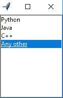
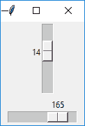
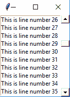
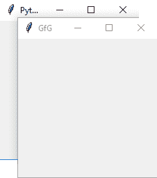

# python GUI–tkinter

> 哎哎哎:# t0]https://www . geeksforgeeks . org/python-GUI-tkinter/

Python 为开发图形用户界面提供了多个选项。在所有的 GUI 方法中，tkinter 是最常用的方法。它是 Python 附带的 Tk 图形用户界面工具包的标准 Python 接口。Python 和 tkinter 是创建图形用户界面应用程序最快最简单的方法。使用 tkinter 创建图形用户界面是一项简单的任务。
**创建 tkinter 应用程序:**

1.  导入模块–tkinter
2.  创建主窗口(容器)
3.  向主窗口添加任意数量的小部件
4.  在小部件上应用事件触发器。

导入 tkinter 与导入 Python 代码中的任何其他模块相同。请注意，Python 2.x 中的模块名称是“tkinter”，Python 3.x 中的模块名称是“Tkinter”。

```py
import tkinter

```

在使用图形用户界面创建 Python 应用程序时，用户需要记住两种主要方法。

1.  **Tk(screenName=None，baseName=None，className='Tk '，useTk=1):** 为了创建主窗口，tkinter 提供了一个方法‘Tk(screenName = None，baseName=None，className='Tk '，useTk = 1)’。要更改窗口的名称，可以将类名更改为所需的名称。用于创建应用程序主窗口的基本代码是:

    ```py
    m=tkinter.Tk() where m is the name of the main window object
    ```

2.  **mainloop():** 当您的应用程序准备运行时，会使用一个名为 mainloop()的方法。mainloop()是一个无限循环，用于运行应用程序，等待事件发生，并在窗口未关闭时处理事件。

    ```py
    m.mainloop()
    ```

    ```py
    import tkinter
    m = tkinter.Tk()
    '''
    widgets are added here
    '''
    m.mainloop()
    ```

tkinter 还提供了对小部件几何配置的访问，可以在父窗口中组织小部件。几何管理器类主要有三类。

1.  **pack()方法:**它将小部件组织成块，然后放入父小部件中。
2.  **grid()方法:**它将小部件组织成网格(类似表格的结构)，然后放入父小部件中。
3.  **place()方法:**它通过将小部件放置在程序员指导的特定位置来组织它们。

有许多小部件可以放在 tkinter 应用程序中。下面解释了一些主要的小部件:

1.  **Button**:To add a button in your application, this widget is used.
    The general syntax is:

    ```py
    w=Button(master, option=value)
    ```

    master 是用于表示父窗口的参数。
    有许多选项用于改变按钮的格式。选项的数量可以作为参数传递，用逗号分隔。下面列出了其中的一些。

    *   **活动背景**:设置按钮在光标下时的背景颜色。
    *   **活动前景**:设置按钮在光标下时的前景色。
    *   **bg** :设置正常背景色。
    *   **命令**:调用函数。
    *   **字体**:设置按钮标签上的字体。
    *   **图像**:设置按钮上的图像。
    *   **宽度**:设置按钮的宽度。
    *   **高度**:设置按钮的高度。

    ```py
    import tkinter as tk
    r = tk.Tk()
    r.title('Counting Seconds')
    button = tk.Button(r, text='Stop', width=25, command=r.destroy)
    button.pack()
    r.mainloop()
    ```

    输出:
    

2.  **Canvas:** It is used to draw pictures and other complex layout like graphics, text and widgets.
    The general syntax is:

    ```py
    w = Canvas(master, option=value)
    master is the parameter used to represent the parent window.
    ```

    有许多选项可用于更改小部件的格式。选项的数量可以作为参数传递，用逗号分隔。下面列出了其中的一些。

    *   **bd** :以像素为单位设置边框宽度。
    *   **bg** :设置正常背景颜色。
    *   **光标**:设置画布中使用的光标。
    *   **高亮颜色**:设置焦点高亮显示的颜色。
    *   **宽度**:设置小部件的宽度。
    *   **高度**:设置小部件的高度。

    ```py
    from tkinter import *
    master = Tk()
    w = Canvas(master, width=40, height=60)
    w.pack()
    canvas_height=20
    canvas_width=200
    y = int(canvas_height / 2)
    w.create_line(0, y, canvas_width, y )
    mainloop()
    ```

    输出:
    

3.  **CheckButton:** To select any number of options by displaying a number of options to a user as toggle buttons. The general syntax is:

    ```py
    w = CheckButton(master, option=value)
    ```

    有许多选项可用于更改此小部件的格式。选项的数量可以作为参数传递，用逗号分隔。下面列出了其中的一些。

    *   **标题**:设置小部件的标题。
    *   **活动背景**:设置小部件在光标下时的背景颜色。
    *   **活动前景**:设置微件在光标下时的前景色。
    *   **bg**: to set he normal backgrouSteganography

        破裂

        密码:

        附上文件:第二种颜色。

    *   **命令**:调用函数。
    *   **字体**:设置按钮标签上的字体。
    *   **图像**:设置小部件上的图像。

```py
from tkinter import *
master = Tk()
var1 = IntVar()
Checkbutton(master, text='male', variable=var1).grid(row=0, sticky=W)
var2 = IntVar()
Checkbutton(master, text='female', variable=var2).grid(row=1, sticky=W)
mainloop()
```

输出:


6.  **Entry:**It is used to input the single line text entry from the user.. For multi-line text input, Text widget is used.
    The general syntax is:

    ```py
    w=Entry(master, option=value)

    ```

    master 是用于表示父窗口的参数。
    有许多选项用于更改小部件的格式。选项的数量可以作为参数传递，用逗号分隔。下面列出了其中的一些。

    *   **bd** :以像素为单位设置边框宽度。
    *   **bg** :设置正常背景颜色。
    *   **光标**:设置使用的光标。
    *   **命令**:调用函数。
    *   **高亮颜色**:设置焦点高亮显示的颜色。
    *   **宽度**:设置按钮的宽度。
    *   **高度**:设置按钮的高度。

    ```py
    from tkinter import *
    master = Tk()
    Label(master, text='First Name').grid(row=0)
    Label(master, text='Last Name').grid(row=1)
    e1 = Entry(master)
    e2 = Entry(master)
    e1.grid(row=0, column=1)
    e2.grid(row=1, column=1)
    mainloop()
    ```

    输出:
    

7.  **Frame:** It acts as a container to hold the widgets. It is used for grouping and organizing the widgets. The general syntax is:

    ```py
    w = Frame(master, option=value)
    master is the parameter used to represent the parent window.
    ```

    有许多选项可用于更改小部件的格式。选项的数量可以作为参数传递，用逗号分隔。下面列出了其中的一些。

    *   **highlightcolor** :设置小部件需要对焦时的对焦高亮颜色。
    *   **bd** :以像素为单位设置边框宽度。
    *   **bg** :设置正常背景颜色。
    *   **光标**:设置使用的光标。
    *   **宽度**:设置小部件的宽度。
    *   **高度**:设置小部件的高度。

    ```py
    from tkinter import *

    root = Tk()
    frame = Frame(root)
    frame.pack()
    bottomframe = Frame(root)
    bottomframe.pack( side = BOTTOM )
    redbutton = Button(frame, text = 'Red', fg ='red')
    redbutton.pack( side = LEFT)
    greenbutton = Button(frame, text = 'Brown', fg='brown')
    greenbutton.pack( side = LEFT )
    bluebutton = Button(frame, text ='Blue', fg ='blue')
    bluebutton.pack( side = LEFT )
    blackbutton = Button(bottomframe, text ='Black', fg ='black')
    blackbutton.pack( side = BOTTOM)
    root.mainloop()
    ```

    输出:
    

8.  **Label**: It refers to the display box where you can put any text or image which can be updated any time as per the code.
    The general syntax is:

    ```py
    w=Label(master, option=value)
    master is the parameter used to represent the parent window.
    ```

    有许多选项可用于更改小部件的格式。选项的数量可以作为参数传递，用逗号分隔。下面列出了其中的一些。

    *   **bg** :设置正常背景色。
    *   **bg** 设置正常背景颜色。
    *   **命令**:调用函数。
    *   **字体**:设置按钮标签上的字体。
    *   **图像**:设置按钮上的图像。
    *   **宽度**:设置按钮的宽度。
    *   **高度**设置按钮的高度。

    ```py
    from tkinter import *
    root = Tk()
    w = Label(root, text='GeeksForGeeks.org!')
    w.pack()
    root.mainloop()
    ```

    输出:
    

9.  **Listbox**: It offers a list to the user from which the user can accept any number of options.
    The general syntax is:

    ```py
    w = Listbox(master, option=value)
    master is the parameter used to represent the parent window.
    ```

    有许多选项可用于更改小部件的格式。选项的数量可以作为参数传递，用逗号分隔。下面列出了其中的一些。

    *   **highlightcolor** :设置小部件需要对焦时的对焦高亮颜色。
    *   **bg** :设置正常背景色。
    *   **bd** :以像素为单位设置边框宽度。
    *   **字体**:设置按钮标签上的字体。
    *   **图像**:设置小部件上的图像。
    *   **宽度**:设置小部件的宽度。
    *   **高度**:设置小部件的高度。

    ```py
    from tkinter import *

    top = Tk()
    Lb = Listbox(top)
    Lb.insert(1, 'Python')
    Lb.insert(2, 'Java')
    Lb.insert(3, 'C++')
    Lb.insert(4, 'Any other')
    Lb.pack()
    top.mainloop()
    ```

    输出:
    

10.  **MenuButton**: It is a part of top-down menu which stays on the window all the time. Every menubutton has its own functionality. The general syntax is:

    ```py
    w = MenuButton(master, option=value)
    master is the parameter used to represent the parent window.
    ```

    有许多选项可用于更改小部件的格式。选项的数量可以作为参数传递，用逗号分隔。下面列出了其中的一些。

    *   **活动背景**:设置鼠标在小部件上时的背景。
    *   **活动前台**:设置鼠标在小部件上时的前台。
    *   **bg** :设置正常背景色。
    *   **bd** :设置指示器周围边框的大小。
    *   **光标**:鼠标悬停在菜单按钮上时出现光标。
    *   **图像**:设置小部件上的图像。
    *   **宽度**:设置小部件的宽度。
    *   **高度**:设置小部件的高度。
    *   **highlightcolor** :设置小部件需要对焦时的对焦高亮颜色。

    ```py
    from tkinter import *

    top = Tk()
    mb =  Menubutton ( top, text = &quot;GfG&quot;)
    mb.grid()
    mb.menu  =  Menu ( mb, tearoff = 0 )
    mb[&quot;menu&quot;]  =  mb.menu
    cVar  = IntVar()
    aVar = IntVar()
    mb.menu.add_checkbutton ( label ='Contact', variable = cVar )
    mb.menu.add_checkbutton ( label = 'About', variable = aVar )
    mb.pack()
    top.mainloop()
    ```

    输出:
    

11.  **菜单**:用于创建应用使用的各种菜单。
    一般句法是:

```py
w = Menu(master, option=value)
master is the parameter used to represent the parent window.
```

有许多选项可用于更改此小部件的格式。选项的数量可以作为参数传递，用逗号分隔。下面列出了其中的一些。

*   **标题**:设置小部件的标题。
*   **活动背景**:设置小部件在光标下时的背景颜色。
*   **活动前景**:设置微件在光标下时的前景色。
*   **bg** :设置正常背景色。
*   **命令**:调用函数。
*   **字体**:设置按钮标签上的字体。
*   **图像**:设置小部件上的图像。

```py
from tkinter import *

root = Tk()
menu = Menu(root)
root.config(menu=menu)
filemenu = Menu(menu)
menu.add_cascade(label='File', menu=filemenu)
filemenu.add_command(label='New')
filemenu.add_command(label='Open...')
filemenu.add_separator()
filemenu.add_command(label='Exit', command=root.quit)
helpmenu = Menu(menu)
menu.add_cascade(label='Help', menu=helpmenu)
helpmenu.add_command(label='About')
mainloop()
```

输出:


*   **Message**: It refers to the multi-line and non-editable text. It works same as that of Label.
    The general syntax is:

    ```py
    w = Message(master, option=value)
    master is the parameter used to represent the parent window.

    ```

    有许多选项可用于更改小部件的格式。选项的数量可以作为参数传递，用逗号分隔。下面列出了其中的一些。

    *   **bd** :设置指示器周围的边框。
    *   **bg** :设置正常背景色。
    *   **字体**:设置按钮标签上的字体。
    *   **图像**:设置小部件上的图像。
    *   **宽度**:设置小部件的宽度。
    *   **高度**:设置小部件的高度。

    ```py
    from tkinter import *
    main = Tk()
    ourMessage ='This is our Message'
    messageVar = Message(main, text = ourMessage)
    messageVar.config(bg='lightgreen')
    messageVar.pack( )
    main.mainloop( )
    ```

    输出:
    

    *   **RadioButton:** It is used to offer multi-choice option to the user. It offers several options to the user and the user has to choose one option.
    The general syntax is:

    ```py
    w = RadioButton(master, option=value)

    ```

    有许多选项可用于更改此小部件的格式。选项的数量可以作为参数传递，用逗号分隔。下面列出了其中的一些。

    *   **活动背景**:设置小部件在光标下时的背景颜色。
    *   **活动前景**:设置微件在光标下时的前景色。
    *   **bg** :设置正常背景色。
    *   **命令**:调用函数。
    *   **字体**:设置按钮标签上的字体。
    *   **图像**:设置小部件上的图像。
    *   **宽度**:以字符为单位设置标签的宽度。
    *   **高度**:以字符为单位设置标签的高度。

    ```py
    from tkinter import *
    root = Tk()
    v = IntVar()
    Radiobutton(root, text='GfG', variable=v, value=1).pack(anchor=W)
    Radiobutton(root, text='MIT', variable=v, value=2).pack(anchor=W)
    mainloop()
    ```

    输出:
    

    *   **Scale:** It is used to provide a graphical slider that allows to select any value from that scale. The general syntax is:

    ```py
    w = Scale(master, option=value)
    master is the parameter used to represent the parent window.

    ```

    有许多选项可用于更改小部件的格式。选项的数量可以作为参数传递，用逗号分隔。下面列出了其中的一些。

    *   **光标**:当鼠标在小部件上时，改变光标模式。
    *   **活动背景**:设置鼠标在小部件上时小部件的背景。
    *   **bg** :设置正常背景色。
    *   **定向**:根据需要设置为水平或垂直。
    *   **从 _** :设置刻度范围一端的值。
    *   **至**:设置刻度范围另一端的值。
    *   **图像**:设置小部件上的图像。
    *   **宽度**:设置小部件的宽度。

    ```py
    from tkinter import *
    master = Tk()
    w = Scale(master, from_=0, to=42)
    w.pack()
    w = Scale(master, from_=0, to=200, orient=HORIZONTAL)
    w.pack()
    mainloop()
    ```

    输出:
    

    *   **Scrollbar**: It refers to the slide controller which will be used to implement listed widgets.
    The general syntax is:

    ```py
    w = Scrollbar(master, option=value)
    master is the parameter used to represent the parent window.

    ```

    有许多选项可用于更改小部件的格式。选项的数量可以作为参数传递，用逗号分隔。下面列出了其中的一些。

    *   **宽度**:设置小部件的宽度。
    *   **活动背景**:设置鼠标在小部件上时的背景。
    *   **bg** :设置正常背景色。
    *   **bd** :设置指示器周围边框的大小。
    *   **光标**:鼠标悬停在菜单按钮上时出现光标。

    ```py
    from tkinter import *
    root = Tk()
    scrollbar = Scrollbar(root)
    scrollbar.pack( side = RIGHT, fill = Y )
    mylist = Listbox(root, yscrollcommand = scrollbar.set )
    for line in range(100):
       mylist.insert(END, 'This is line number' + str(line))
    mylist.pack( side = LEFT, fill = BOTH )
    scrollbar.config( command = mylist.yview )
    mainloop()
    ```

    输出:
    

    *   **Text:** To edit a multi-line text and format the way it has to be displayed.
    The general syntax is:

    ```py
    w  =Text(master, option=value)

    ```

    有许多选项可用于更改文本格式。选项的数量可以作为参数传递，用逗号分隔。下面列出了其中的一些。

    *   **highlightcolor** :设置小部件需要对焦时的对焦高亮颜色。
    *   **插入背景**:设置小部件的背景。
    *   **bg** :设置正常背景色。
    *   **字体**:设置按钮标签上的字体。
    *   **图像**:设置小部件上的图像。
    *   **宽度**:设置小部件的宽度。
    *   **高度**:设置小部件的高度。

    ```py
    from tkinter import *
    root = Tk()
    T = Text(root, height=2, width=30)
    T.pack()
    T.insert(END, 'GeeksforGeeks\nBEST WEBSITE\n')
    mainloop()
    ```

    输出:
    

    *   **TopLevel:** This widget is directly controlled by the window manager. It don’t need any parent window to work on.The general syntax is:

    ```py
    w = TopLevel(master, option=value)

    ```

    有许多选项可用于更改小部件的格式。选项的数量可以作为参数传递，用逗号分隔。下面列出了其中的一些。

    *   **bg** :设置正常背景色。
    *   **bd** :设置指示器周围边框的大小。
    *   **光标**:鼠标悬停在菜单按钮上时出现光标。
    *   **宽度**:设置小部件的宽度。
    *   **高度**:设置小部件的高度。

    ```py
    from tkinter import *
    root = Tk()
    root.title('GfG')
    top = Toplevel()
    top.title('Python')
    top.mainloop()
    ```

    输出:
    

    *   **SpinBox:** It is an entry of ‘Entry’ widget. Here, value can be input by selecting a fixed value of numbers.The general syntax is:

    ```py
    w = SpinBox(master, option=value)

    ```

    有许多选项可用于更改小部件的格式。选项的数量可以作为参数传递，用逗号分隔。下面列出了其中的一些。

    *   **bg** :设置正常背景色。
    *   **bd** :设置指示器周围边框的大小。
    *   **光标**:鼠标悬停在菜单按钮上时出现光标。
    *   **命令**:调用函数。
    *   **宽度**:设置小部件的宽度。
    *   **活动背景**:设置鼠标在小部件上时的背景。
    *   **禁用背景**:当鼠标在小部件上时禁用背景。
    *   **from_** :设置范围一端的值。
    *   **至**:设置范围另一端的值。

    ```py
    from tkinter import *
    master = Tk()
    w = Spinbox(master, from_ = 0, to = 10)
    w.pack()
    mainloop()
    ```

    输出:
    

    *   **PannedWindow**It is a container widget which is used to handle number of panes arranged in it. The general syntax is:

    ```py
    w = PannedWindow(master, option=value)

    ```

    master 是用于表示父窗口的参数。
    有许多选项用于更改小部件的格式。选项的数量可以作为参数传递，用逗号分隔。下面列出了其中的一些。

    *   **bg** :设置正常背景色。
    *   **bd** :设置指示器周围边框的大小。
    *   **光标**:鼠标悬停在菜单按钮上时出现光标。
    *   **宽度**:设置小部件的宽度。
    *   **高度**:设置小部件的高度。

    ```py
    from tkinter import *
    m1 = PanedWindow()
    m1.pack(fill = BOTH, expand = 1)
    left = Entry(m1, bd = 5)
    m1.add(left)
    m2 = PanedWindow(m1, orient = VERTICAL)
    m1.add(m2)
    top = Scale( m2, orient = HORIZONTAL)
    m2.add(top)
    mainloop()
    ```

    输出:
    

本文由 **[里沙布·班萨尔](https://www.linkedin.com/in/rishabh-bansal-9b4b71108/)** 供稿。如果你喜欢 GeeksforGeeks 并想投稿，你也可以使用[contribute.geeksforgeeks.org](http://www.contribute.geeksforgeeks.org)写一篇文章或者把你的文章邮寄到 contribute@geeksforgeeks.org。看到你的文章出现在极客博客主页上，帮助其他极客。

如果你发现任何不正确的地方，或者你想分享更多关于上面讨论的话题的信息，请写评论。