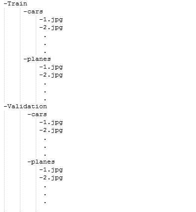

# Python |使用 Keras 的图像分类

> 原文:[https://www . geeksforgeeks . org/python-image-classing-using-keras/](https://www.geeksforgeeks.org/python-image-classification-using-keras/)

先决条件:[使用 CNN 的图像分类器](https://www.geeksforgeeks.org/image-classifier-using-cnn/)
图像分类是一种使用如下方法将图像分类到它们各自的类别类别中的方法:

*   从头开始训练一个小网络
*   使用 VGG16 微调模型的顶层

让我们讨论如何从头开始训练模型，并对包含汽车和飞机的数据进行分类。
**列车数据:**列车数据包含每节车厢和飞机的 200 幅图像即总计有 400 幅图像在训练数据集中
**测试数据:**测试数据包含每节车厢和飞机的 50 幅图像即总计有 100 幅图像在测试数据集中
要下载完整的数据集，点击此处。

**模型描述:**在开始模型之前，首先准备数据集及其排列。请看下图:



为了提供数据集文件夹，它们应该只以这种格式制作和提供。所以现在，让我们从模型开始:
为了训练模型，我们不需要大型高端机器和 GPU，我们也可以使用 CPU。首先，在给定的代码中包含以下库:

## 蟒蛇 3

```py
# Importing all necessary libraries
from keras.preprocessing.image import ImageDataGenerator
from keras.models import Sequential
from keras.layers import Conv2D, MaxPooling2D
from keras.layers import Activation, Dropout, Flatten, Dense
from keras import backend as K

img_width, img_height = 224, 224
```

数据集中的每个图像的大小都是 224*224。

## 蟒蛇 3

```py
train_data_dir = 'v_data/train'
validation_data_dir = 'v_data/test'
nb_train_samples =400
nb_validation_samples = 100
epochs = 10
batch_size = 16
```

这里，train_data_dir 是 train 数据集目录。 *validation_data_dir* 是验证数据的目录。 *nb_train_samples* 为列车样本总数。 *nb_validation_samples* 为验证样本总数。

**检查图像格式:**

## 蟒蛇 3

```py
if K.image_data_format() == 'channels_first':
    input_shape = (3, img_width, img_height)
else:
    input_shape = (img_width, img_height, 3)
```