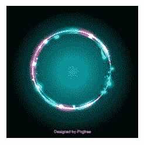

# Python | imageops . autocontrast()方法

> 哎哎哎:# t0]https://www . geeksforgeeks . org/python-imageops-self-contracting method/

PIL is the Python Imaging Library which provides the python interpreter with image editing capabilities. the **ImageOps module** contains a number of ‘ready-made’ image processing operations. This module is somewhat experimental, and most operators only work on L and RGB images.`**ImageOps.autocontrast()**` method maximizes (normalize) image contrast. This function calculates a histogram of the input image, removes cutoff percent of the lightest and darkest pixels from the histogram, and remaps the image so that the darkest pixel becomes black (0), and the lightest becomes white (255).

> **语法:** PIL。ImageOps.autocontrast(图像，截止=0，忽略=无)
> 
> **参数:**
> **图像:**对图像进行处理。
> **截止:**从柱状图中截止多少百分比。
> **忽略:**背景像素值(无背景使用无)。
> 
> **返回:**一个图像。

所用图像:


```py
# Importing Image and ImageOps module from PIL package  
from PIL import Image, ImageOps 

# creating a image1 object 
im1 = Image.open(r"C:\Users\sadow984\Desktop\download2.JPg")

# applying autocontrast method 
im2 = ImageOps.autocontrast(im1, cutoff = 2, ignore = 2)

im2.show() 
```

**输出:**


```py
# Importing Image and ImageOps module from PIL package  
from PIL import Image, ImageOps 

# creating a image1 object 
im1 = Image.open(r"C:\Users\sadow984\Desktop\download2.JPg")

# applying autocontrast method 
im2 = ImageOps.autocontrast(im1, cutoff = 5, ignore = 5)

im2.show() 
```

**输出:**
