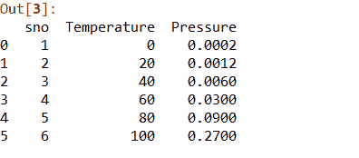
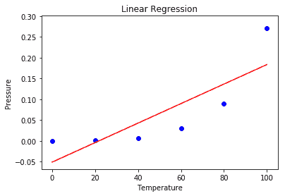

# Python |多项式回归的实现

> 原文:[https://www . geesforgeks . org/python-多项式回归的实现/](https://www.geeksforgeeks.org/python-implementation-of-polynomial-regression/)

**多项式回归**是一种线性回归形式，其中自变量 x 和因变量 y 之间的关系被建模为*第 n 次*次多项式。多项式回归拟合 x 的值和 y 的相应条件平均值之间的非线性关系，表示为 E(y |x)
**为什么多项式回归:**

*   有一些关系，研究人员会假设是曲线的。显然，这类情况将包括多项式项。
*   残留物检验。如果我们试图将线性模型拟合到曲线数据，预测器(X 轴)上的残差散点图(Y 轴)将在中间有许多正残差的面片。因此在这种情况下，这是不合适的。
*   通常多元线性回归分析的一个假设是所有的自变量都是独立的。在多项式回归模型中，这个假设是不满足的。

**多项式回归的用途:**
这些基本上用于定义或描述非线性现象，例如:

*   组织的生长速度。
*   疾病流行的进展
*   湖泊沉积物中碳同位素的分布

回归分析的基本目标是用自变量 x 的值来模拟因变量 y 的期望值。在简单回归中，我们使用以下等式–

```py
y = a + bx + e
```

这里 y 是因变量，a 是 y 截距，b 是斜率，e 是误差率。
在很多情况下，这种线性模型是行不通的，例如，如果我们根据合成发生的温度来分析化学合成的产物，在这种情况下，我们使用二次模型

```py
y = a + b1x + b2^2 + e
```

这里 y 是 x 上的因变量，a 是 y 截距，e 是误差率。
一般来说，我们可以为第 n 个值建模。

```py
y = a + b1x + b2x^2 +....+ bnx^n
```

由于回归函数在未知变量方面是线性的，因此从估计的角度来看，这些模型是线性的。
因此，通过最小二乘法，让我们计算响应值 y .
**Python 中的多项式回归:**
要获取用于多项式回归分析的数据集，请单击此处的。
**第一步:**导入库和数据集
导入我们用来进行多项式回归的重要库和数据集。

## 蟒蛇 3

```py
# Importing the libraries
import numpy as np
import matplotlib.pyplot as plt
import pandas as pd

# Importing the dataset
datas = pd.read_csv('data.csv')
datas
```



**第二步:**将数据集分成 2 个部分
将数据集分成 X 和 y 两个部分，X 将包含 1 到 2 之间的列。y 将包含 2 列。

## 蟒蛇 3

```py
X = datas.iloc[:, 1:2].values
y = datas.iloc[:, 2].values
```

**步骤 3:** 拟合数据集的线性回归
拟合两个分量上的线性回归模型。

## 蟒蛇 3

```py
# Fitting Linear Regression to the dataset
from sklearn.linear_model import LinearRegression
lin = LinearRegression()

lin.fit(X, y)
```

**步骤 4:** 将多项式回归拟合到数据集
在两个分量 X 和 y 上拟合多项式回归模型

## 蟒蛇 3

```py
# Fitting Polynomial Regression to the dataset
from sklearn.preprocessing import PolynomialFeatures

poly = PolynomialFeatures(degree = 4)
X_poly = poly.fit_transform(X)

poly.fit(X_poly, y)
lin2 = LinearRegression()
lin2.fit(X_poly, y)
```

**第 5 步:**在这一步中，我们使用散点图来可视化线性回归结果。

## 蟒蛇 3

```py
# Visualising the Linear Regression results
plt.scatter(X, y, color = 'blue')

plt.plot(X, lin.predict(X), color = 'red')
plt.title('Linear Regression')
plt.xlabel('Temperature')
plt.ylabel('Pressure')

plt.show()
```



**第 6 步:**使用散点图可视化多项式回归结果。

## 蟒蛇 3

```py
# Visualising the Polynomial Regression results
plt.scatter(X, y, color = 'blue')

plt.plot(X, lin2.predict(poly.fit_transform(X)), color = 'red')
plt.title('Polynomial Regression')
plt.xlabel('Temperature')
plt.ylabel('Pressure')

plt.show()
```


**第 7 步:**用线性和多项式回归预测新结果。

## 蟒蛇 3

```py
# Predicting a new result with Linear Regression
lin.predict(110.0)
```


## 蟒蛇 3

```py
# Predicting a new result with Polynomial Regression
lin2.predict(poly.fit_transform(110.0))
```


**使用多项式回归的优势:**

*   广泛的功能可以安装在它下面。
*   多项式基本上适合各种曲率。
*   多项式提供了因变量和自变量之间关系的最佳近似值。

**使用多项式回归的缺点**

*   这些对异常值过于敏感。
*   数据中存在一两个异常值会严重影响非线性分析的结果。
*   此外，遗憾的是，用于检测非线性回归中异常值的模型验证工具比线性回归中的要少。