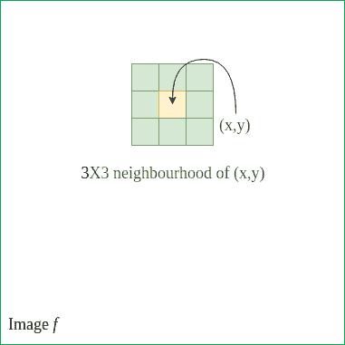
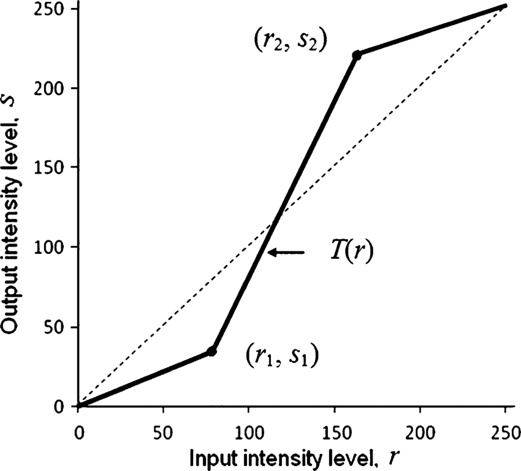

# Python |图像上的强度变换操作

> 原文:[https://www . geeksforgeeks . org/python-强度-转换-图像上的操作/](https://www.geeksforgeeks.org/python-intensity-transformation-operations-on-images/)

对图像应用强度变换以进行对比度处理或图像阈值处理。这些是在空间域中，即它们直接在手头图像的像素上执行，而不是在图像的傅立叶变换上执行。

以下是常用的强度变换:

1.  **图像底片(线性)**
2.  **日志转换**
3.  **幂律(γ)变换**
4.  **分段线性变换函数**

****

****空间域过程–**
空间域过程可以使用以下等式来描述:![g(x, y) = T[f(x, y)]](img/4cf3378f148adb6cbb01f8191d1f34eb.png "Rendered by QuickLaTeX.com")其中是输入图像， *T* 是在点 *(x，y)* 的邻域上定义的 *f* 上的算子，是输出。**

****

****图像底片–****

**图像底片在这篇[文章](https://www.geeksforgeeks.org/c-program-to-invert-making-negative-an-image-content-in-pgm-format/)中讨论。数学上，假设图像从亮度级 0 到(L-1)。一般 L = 256。然后，负变换可以用表达式 *s = L-1-r* 来描述，其中 r 是像素的初始强度水平，s 是像素的最终强度水平。这就产生了照相底片。**

## **日志转换–**

**数学上，对数变换可以表示为`s = clog(1+r)`。这里，s 是输出强度，r > =0 是像素的输入强度，c 是缩放常数。c 由`255/(log (1 + m))`给出，其中 m 为图像中最大像素值。这样做是为了确保最终像素值不超过(L-1)或 255。实际上，对数变换将窄范围的低强度输入值映射到宽范围的输出值。**

**考虑以下输入图像。**

****

**下面是对图像应用日志转换的代码。**

```
import cv2
import numpy as np

# Open the image.
img = cv2.imread('sample.jpg')

# Apply log transform.
c = 255/(np.log(1 + np.max(img)))
log_transformed = c * np.log(1 + img)

# Specify the data type.
log_transformed = np.array(log_transformed, dtype = np.uint8)

# Save the output.
cv2.imwrite('log_transformed.jpg', log_transformed)
```

**下面是对数转换后的输出。
**

## **幂律(伽玛)变换–**

**幂律(γ)变换在数学上可以表示为。伽马校正对于在屏幕上正确显示图像非常重要，以防止从具有不同显示设置的不同类型的显示器上观看图像时出现褪色或变暗。这是因为我们的眼睛以伽马曲线感知图像，而相机以线性方式捕捉图像。下面是应用伽马校正的 Python 代码。**

```
import cv2
import numpy as np

# Open the image.
img = cv2.imread('sample.jpg')

# Trying 4 gamma values.
for gamma in [0.1, 0.5, 1.2, 2.2]:

    # Apply gamma correction.
    gamma_corrected = np.array(255*(img / 255) ** gamma, dtype = 'uint8')

    # Save edited images.
    cv2.imwrite('gamma_transformed'+str(gamma)+'.jpg', gamma_corrected)
```

**以下是不同伽马值的伽马校正输出。**

****Gamma = 0.1:**
**

****Gamma = 0.5:**
**

****Gamma = 1.2:**
**

****Gamma = 2.2:**
**

**从输出以及曲线图中可以观察到，γ> 1(由曲线图上对应于“n 次方”标签的曲线表示)，像素强度降低，即图像变暗。另一方面，γ< 1(由对应于图上‘第 n 根’标记的曲线表示)，强度增加，即图像变得更亮。**

## **分段线性变换函数–**

**顾名思义，这些函数本质上并不完全是线性的。然而，它们在某些 x 间隔之间是线性的。最常用的分段线性变换函数之一是对比度拉伸。**

**对比度可以定义为:**

```
`Contrast =  (I_max - I_min)/(I_max + I_min)`
```

**这一过程扩大了图像中亮度等级的范围，使其覆盖了摄像机/显示器的全部亮度。下图显示了对应于对比度拉伸的图表。
**

**以(r1，s1)，(r2，s2)为参数，该函数通过实质上降低暗像素的强度和增加亮像素的强度来扩展强度水平。如果`r1 = s1 = 0` 和`r2 = s2 = L-1`，函数在图中变成一条直线虚线(没有效果)。该函数是单调递增的，因此保持了像素之间的强度等级顺序。**

**下面是执行对比度拉伸的 Python 代码。**

```
import cv2
import numpy as np

# Function to map each intensity level to output intensity level.
def pixelVal(pix, r1, s1, r2, s2):
    if (0 <= pix and pix <= r1):
        return (s1 / r1)*pix
    elif (r1 < pix and pix <= r2):
        return ((s2 - s1)/(r2 - r1)) * (pix - r1) + s1
    else:
        return ((255 - s2)/(255 - r2)) * (pix - r2) + s2

# Open the image.
img = cv2.imread('sample.jpg')

# Define parameters.
r1 = 70
s1 = 0
r2 = 140
s2 = 255

# Vectorize the function to apply it to each value in the Numpy array.
pixelVal_vec = np.vectorize(pixelVal)

# Apply contrast stretching.
contrast_stretched = pixelVal_vec(img, r1, s1, r2, s2)

# Save edited image.
cv2.imwrite('contrast_stretch.jpg', contrast_stretched)
```

****输出:**
**