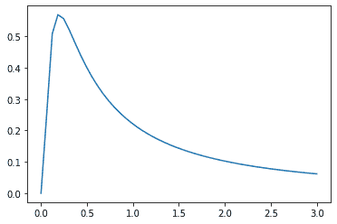
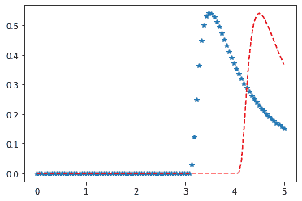

# Python–统计中的逆威布尔分布

> 原文:[https://www . geesforgeks . org/python-逆威布尔-统计中的分布/](https://www.geeksforgeeks.org/python-inverse-weibull-distribution-in-statistics/)

**scipy.stats.invweibull()** 是一个反向的 weibull 连续随机变量，用标准格式和一些形状参数定义，以完成其规格

**参数:**

> **q :** 上下尾概率
> T3】x:分位数
> **loc :** 【可选】位置参数。默认= 0
> **比例:**【可选】比例参数。默认值= 1
> **大小:**【整数元组，可选】形状或随机变量。
> **时刻:**【可选】由字母['mvsk']组成；m’=均值，‘v’=方差，‘s’= Fisher 偏斜度，‘k’= Fisher 峰度。(默认值= 'mv ')。
> 
> **结果:**逆威布尔连续随机变量

**代码#1:创建倒威布尔连续随机变量**

```
# importing library
from scipy.stats import invweibull  

numargs = invweibull.numargs 
[a] = [0.6, ] * numargs 
rv = invweibull(a) 

print ("RV : \n", rv)  
```

**输出:**

```
RV : 
 scipy.stats._distn_infrastructure.rv_frozen object at 0x000002A9D4EAE9C8

```

 **代码#2:倒威布尔连续变量和概率分布**

```
import numpy as np 
quantile = np.arange (0.01, 1, 0.1) 

# Random Variates 
R = invweibull.rvs(a, scale = 2, size = 10) 
print ("Random Variates : \n", R) 

# PDF 
R = invweibull.pdf(a, quantile, loc = 0, scale = 1) 
print ("\nProbability Distribution : \n", R) 
```

**输出:**

```
Random Variates : 
 [ 2.46502056 32.97160826  8.65843435  1.21357636  0.22162243  1.05724138
  7.5574935   0.0624836   0.83384033 17.29417907]

Probability Distribution : 
 [0.00613124 0.06733615 0.12799203 0.18757349 0.24553408 0.30131353
 0.35434638 0.40407156 0.44994318 0.49144206]

```

**代码#3:图形表示。**

```
import numpy as np 
import matplotlib.pyplot as plt 

distribution = np.linspace(0, np.minimum(rv.dist.b, 3)) 
print("Distribution : \n", distribution) 

plot = plt.plot(distribution, rv.pdf(distribution)) 
```

**输出:**

```
Distribution : 
 [0\.         0.06122449 0.12244898 0.18367347 0.24489796 0.30612245
 0.36734694 0.42857143 0.48979592 0.55102041 0.6122449  0.67346939
 0.73469388 0.79591837 0.85714286 0.91836735 0.97959184 1.04081633
 1.10204082 1.16326531 1.2244898  1.28571429 1.34693878 1.40816327
 1.46938776 1.53061224 1.59183673 1.65306122 1.71428571 1.7755102
 1.83673469 1.89795918 1.95918367 2.02040816 2.08163265 2.14285714
 2.20408163 2.26530612 2.32653061 2.3877551  2.44897959 2.51020408
 2.57142857 2.63265306 2.69387755 2.75510204 2.81632653 2.87755102
 2.93877551 3\.        ]

```




 **代码#4:不同的位置参数**

```
import matplotlib.pyplot as plt 
import numpy as np 

x = np.linspace(0, 5, 100) 

# Varying positional arguments 
y1 = invweibull .pdf(x, 1, 3) 
y2 = invweibull .pdf(x, 1, 4) 
plt.plot(x, y1, "*", x, y2, "r--") 
```

**输出:**