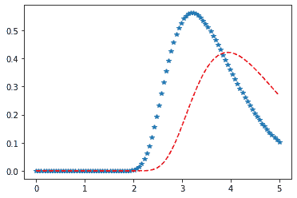

# Python–统计中的 Kolmogorov-Smirnov 分布

> 原文:[https://www . geesforgeks . org/python-Kolmogorov-Smirnov-distribution-in-statistics/](https://www.geeksforgeeks.org/python-kolmogorov-smirnov-distribution-in-statistics/)

**scipy . stats . kstwobgin()**是针对大 N 测试的 Kolmogorov-Smirnov 双边测试，用标准格式和一些形状参数定义，完成其规范。它是一种统计检验，测量理论 CDF 与经验 CDF 的最大绝对距离。

**参数:**

> **q :** 上下尾概率
> T3】x:分位数
> **loc :** 【可选】位置参数。默认= 0
> **比例:**【可选】比例参数。默认值= 1
> **大小:**【整数元组，可选】形状或随机变量。
> 
> **结果:** kstwobign 连续随机变量

**代码#1:创建 kstwobign 连续随机变量**

```
# importing library

from scipy.stats import kstwobign  

numargs = kstwobign.numargs 
a, b = 4.32, 3.18
rv = kstwobign(a, b) 

print ("RV : \n", rv)  

```

**输出:**

```
RV : 
 scipy.stats._distn_infrastructure.rv_frozen object at 0x000002A9D54959C8

```

 **代码# 2:kstwobgen 连续变量和概率分布**

```
import numpy as np 
quantile = np.arange (0.01, 1, 0.1) 

# Random Variates 
R = kstwobign.rvs(a, b, scale = 2, size = 10) 
print ("Random Variates : \n", R) 
```

**输出:**

```
Random Variates : 
 [3.88510141 3.48394857 3.66124797 3.88484201 3.86533511 3.21176073
 4.10238585 3.42397866 3.85111721 4.36433596]

```

**代码#3:图形表示。**

```
import numpy as np 
import matplotlib.pyplot as plt 

distribution = np.linspace(0, np.minimum(rv.dist.b, 3)) 
print("Distribution : \n", distribution) 

plot = plt.plot(distribution, rv.pdf(distribution)) 
```

**输出:**

```
Distribution : 
 [0\.         0.06122449 0.12244898 0.18367347 0.24489796 0.30612245
 0.36734694 0.42857143 0.48979592 0.55102041 0.6122449  0.67346939
 0.73469388 0.79591837 0.85714286 0.91836735 0.97959184 1.04081633
 1.10204082 1.16326531 1.2244898  1.28571429 1.34693878 1.40816327
 1.46938776 1.53061224 1.59183673 1.65306122 1.71428571 1.7755102
 1.83673469 1.89795918 1.95918367 2.02040816 2.08163265 2.14285714
 2.20408163 2.26530612 2.32653061 2.3877551  2.44897959 2.51020408
 2.57142857 2.63265306 2.69387755 2.75510204 2.81632653 2.87755102
 2.93877551 3\.        ]

```


**代码#4:变化的位置参数**

```
import matplotlib.pyplot as plt 
import numpy as np 

x = np.linspace(0, 5, 100) 

# Varying positional arguments 
y1 = kstwobign .pdf(x, 1, 3) 
y2 = kstwobign .pdf(x, 1, 4) 
plt.plot(x, y1, "*", x, y2, "r--") 
```

**输出:**

